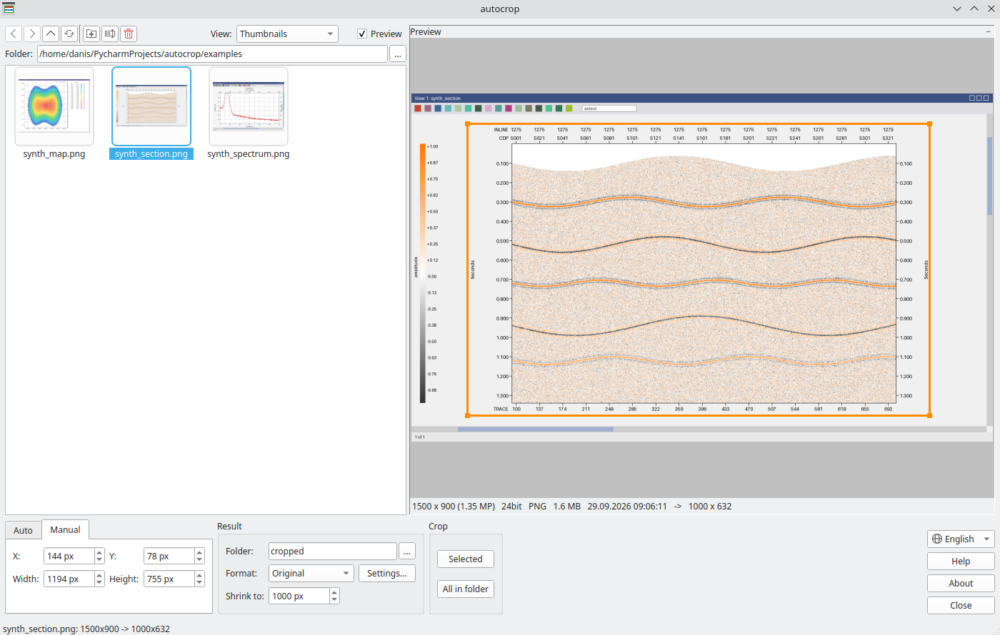

# autocrop

Batch cropping of screenshots with working images - gathers, sections, slices,
maps, spectra - for a whole folder at once. The window title, toolbars, scroll
bars, status bar and empty space are cut off; the frame is found automatically on
every screenshot. What remains is the image, the image with axes or with all
annotations - ready for a report or a presentation.


## Download

[:material-microsoft-windows: Windows](https://github.com/daniscoder/daniscoder.github.io/releases/download/autocrop/autocrop.exe){ .md-button .md-button--primary }
[:material-linux: Linux](https://github.com/daniscoder/daniscoder.github.io/releases/download/autocrop/autocrop){ .md-button }
[:material-linux: Linux (older systems)](https://github.com/daniscoder/daniscoder.github.io/releases/download/autocrop/autocrop-legacy){ .md-button }

The Linux version is for systems with glibc 2.38 or newer: Ubuntu 24.04+, Debian
13, Fedora 39+, RHEL, Rocky and Alma 10. For older ones - CentOS 7, RHEL, Rocky and
Alma 8 and 9, Ubuntu 22.04, Debian 12, Astra Linux - use the "Linux (older
systems)" build: it is built with Qt5 and runs on any system with glibc 2.17 or
newer ([details](index.md#run)).

Version 1.2. Sample data - synthetic window screenshots, the pictures below are
made from them:

- [synth_section.png](examples/autocrop/synth_section.png) - a section: two rows
  of labels above the image, time on both sides, a color bar on the left;
- [synth_map.png](examples/autocrop/synth_map.png) - a map: axes on the left and
  at the bottom, a scroll bar inside the plot area, a color table on the right;
- [synth_spectrum.png](examples/autocrop/synth_spectrum.png) - a spectrum: a
  title and axis names.

## What to keep

On every screenshot the program finds three frames. In the window they are shown
on the preview, the selected one is thicker.

- **Image** (green) - only the data area, exactly along its frame. For
  a map without a frame - along the axes and the outermost data points; a scroll
  bar inside the plot area is cut off.
- **With axes** (red) - also the tick labels above and below the image,
  all rows, and the values of the vertical axis. In width - up to the edge of
  these values: row names to the left of it are cut off.
- **With annotations** (blue) - everything around the image:
  titles, axis names, color bars, tables, labels above a map.


**Margin** - a few pixels around the axes and annotations; the image
is cut without it.

## Manual mode

If the screenshots are alike - one window, one scale - the Manual tab
cuts the same rectangle from all of them: X, Y, width and height in screenshot
pixels. It can be set with the mouse right in the preview: drag an edge or a
corner to resize, drag from inside to move, drag outside the frame to draw a new
one. Arrow keys move the frame by 10 pixels, with Shift - by one.



## Result

The result goes to the output folder - `cropped` next to the screenshots by
default, or any chosen one - under the same names. If the folder field is empty,
the result goes next to the screenshot with a `_cr` suffix in the name; the
original screenshots are never overwritten.

Format - as the screenshot or PNG, JPG, BMP. PNG is best for window screenshots:
smaller and lossless; the "256-color palette" checkbox in the Settings... window
makes it another 2-4 times smaller. The JPG quality is set
there too: below 85 the labels get visibly blurred.

Shrink to - if the longer side of the result is larger than the
given size, the image is scaled down proportionally to it. The size under the
preview already includes cropping and shrinking.

The selected screenshots or all screenshots of the folder are cropped, on all
processor cores.

## File list

On the left is a folder browser: thumbnails, a list or a detailed list with
image size, file size and date. Folders open with a double click; there are
back, forward, up, cut, copy and paste (including with Explorer), rename (F2),
delete to trash and new folder - as buttons above the list, in the right-click
menu and with the usual keys. Under the preview - the screenshot size and what
it becomes after cropping.

## Without the window

With arguments the program works as a console one - for batch processing from
scripts:

```
autocrop screenshot.png folder_with_screenshots -k axes -f png -o cropped
```

`-k all|axes|image` - what to keep, `-o` - output folder (`-o ""` - next to the
screenshot with a `_cr` suffix), `-f png|jpg|bmp` - format, `-m` - margin, `-q` -
JPG quality, `--palette` - PNG with a palette, `--box X Y W H` - cut this
rectangle from all screenshots, `--max-side` - shrink to this longer side; all
options - `autocrop -h`.

## Version history

| Version | What's new |
|---|---|
| 1.2 | English interface: the language follows the system and can be switched in the window |
| 1.1 | Manual cropping: one rectangle for all screenshots, with the mouse in the preview or with arrow keys; shrinking by the longer side; format settings in their own window |
| 1.0 | First version: three cropping levels, a window with a file browser and a frame preview, batch processing on all cores, console mode |
