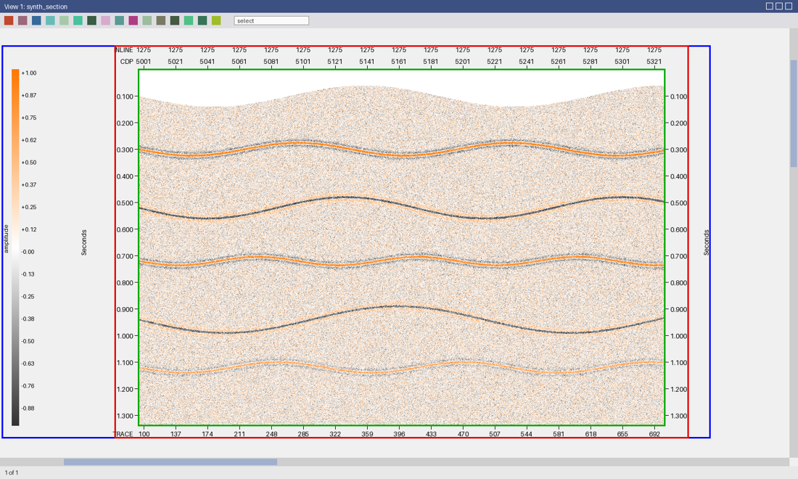
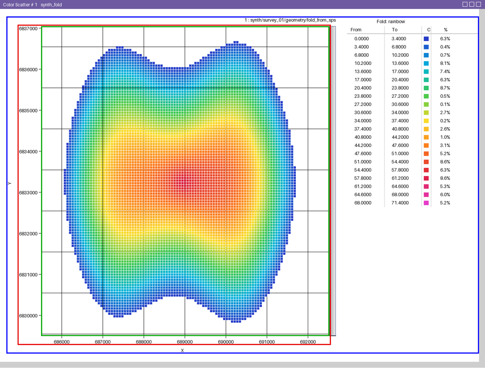
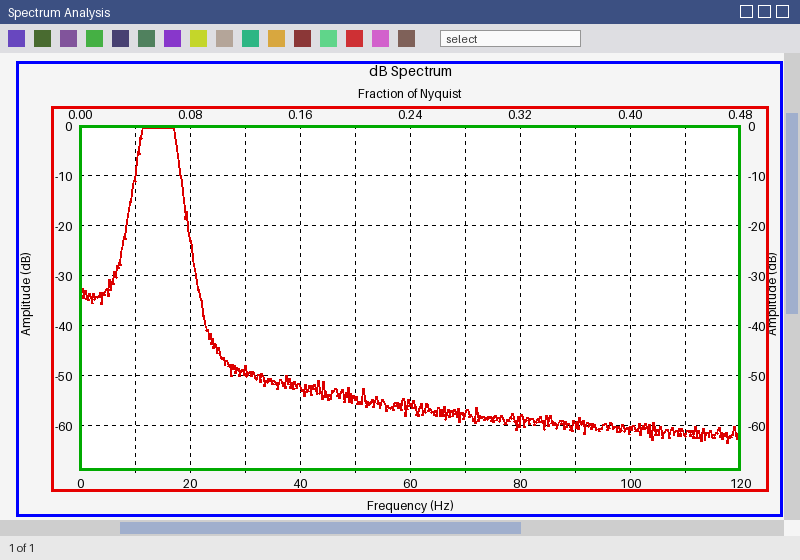
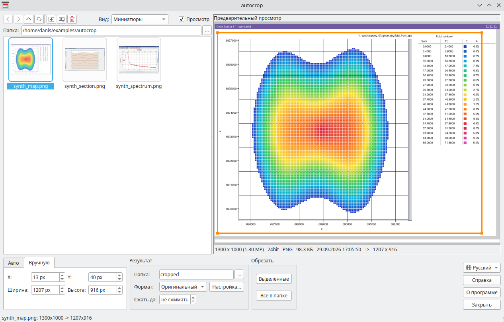

# autocrop

Обрезка снимков экрана с рабочими картинками - сейсмограммами, разрезами,
слайсами, картами, спектрами - пакетом, сразу для всей папки. Заголовок окна,
панели инструментов, полосы прокрутки, строка состояния и пустое поле
отрезаются, рамка находится сама по каждому снимку. Остается картинка, картинка с
осями или со всем оформлением - готовое для отчета или презентации.


## Скачать

[:material-microsoft-windows: Windows](https://github.com/daniscoder/daniscoder.github.io/releases/download/autocrop/autocrop.exe){ .md-button .md-button--primary }
[:material-linux: Linux](https://github.com/daniscoder/daniscoder.github.io/releases/download/autocrop/autocrop){ .md-button }
[:material-linux: Linux (старые системы)](https://github.com/daniscoder/daniscoder.github.io/releases/download/autocrop/autocrop-legacy){ .md-button }

Linux-версия - для систем с glibc 2.38 и новее: Ubuntu 24.04+, Debian 13,
Fedora 39+, RHEL, Rocky и Alma 10. Для более старых - CentOS 7, RHEL, Rocky и Alma 8 и 9, Ubuntu 22.04,
Debian 12, Astra Linux - сборка «Linux (старые системы)»: она на Qt5 и запускается на
любой системе с glibc 2.17 и новее ([подробнее](index.md#run)).

Версия 1.2. Примеры для пробы - синтетические снимки окон, на них сняты
картинки ниже:

- [synth_section.png](examples/autocrop/synth_section.png) - разрез: два ряда
  подписей над картинкой, время с двух сторон, палитра слева;
- [synth_map.png](examples/autocrop/synth_map.png) - карта: оси слева и снизу,
  полоса прокрутки внутри поля, таблица палитры справа;
- [synth_spectrum.png](examples/autocrop/synth_spectrum.png) - спектр:
  заголовок и названия осей.

## Что оставлять

На каждом снимке программа находит три рамки. В окне они видны на
предварительном просмотре, выбранная толще.

- **Картинку** (зеленая) - только поле данных, точно по его рамке. У карты без
  рамки - по осям и крайним точкам данных; полоса прокрутки внутри поля
  отрезается.
- **С осями** (красная) - еще подписи делений над и под картинкой, все ряды, и
  значения вертикальной оси. По ширине - до края этих значений: названия рядов
  слева за ним обрезаются.
- **С оформлением** (синяя) - все вокруг картинки: заголовки, названия осей,
  палетки, таблицы, подписи над картой.







**Отступ** - поле в несколько пикселов вокруг осей и оформления; картинка
режется без него.

## Вручную

Если снимки одинаковые - одно окно, один масштаб, - на вкладке «Вручную» у всех
режется один прямоугольник: X, Y, ширина и высота в пикселах снимка. Его можно
задать мышью прямо в просмотре: за край или угол - размер, изнутри - сдвиг, вне
рамки - нарисовать заново. Стрелки двигают рамку на 10 пикселов, с Shift - на
один.



## Результат

Результат ложится в папку результата - по умолчанию `cropped` рядом со
снимками, или любую выбранную - под теми же именами. Если поле папки пустое,
результат ложится рядом со снимком с хвостом `_cr` в имени; исходные снимки не
перезаписываются никогда.

Формат - как у снимка или PNG, JPG, BMP. Для снимков окон лучше PNG: меньше и
без потерь; галочка «Палитра 256 цветов» в окне «Настройка...» уменьшает его еще
в 2-4 раза. Там же качество JPG: ниже 85 подписи на снимке заметно мылятся.

«Сжать до» - если длинная сторона результата больше заданной, картинка
пропорционально уменьшается до нее. Под просмотром виден размер уже после
обрезки и сжатия.

Обрезаются выделенные снимки или все снимки папки, на всех ядрах процессора.

## Список файлов

Слева - обозреватель папки: миниатюры, список или подробный список с размером
снимка, объемом и датой. Папки открываются двойным щелчком, есть назад, вперед,
вверх, вырезать, копировать и вставить (в том числе с Проводником), переименовать
(F2), удалить в корзину и новая папка - кнопками над списком, в меню по правой
кнопке и привычными клавишами. Под просмотром - размер снимка и каким он станет
после обрезки.

## Без окна

С аргументами программа работает как консольная - для пакетной обработки из
скриптов:

```
autocrop снимок.png папка_со_снимками -k axes -f png -o cropped
```

`-k all|axes|image` - что оставлять, `-o` - папка результата (`-o ""` - рядом со
снимком с хвостом `_cr`), `-f png|jpg|bmp` - формат, `-m` - отступ, `-q` -
качество JPG, `--palette` - PNG с палитрой, `--box X Y W H` - резать этот
прямоугольник у всех, `--max-side` - сжать до длинной стороны; все ключи -
`autocrop -h`.

## История версий

| Версия | Что нового |
|---|---|
| 1.2 | Английский интерфейс: язык берется из системы и переключается списком в окне |
| 1.1 | Обрезка вручную: один прямоугольник для всех снимков, мышью в просмотре или стрелками; сжатие по длинной стороне; настройки формата в своем окне |
| 1.0 | Первая версия: три уровня обрезки, окно с обозревателем и просмотром рамок, пакетная обработка на всех ядрах, консольный режим |
