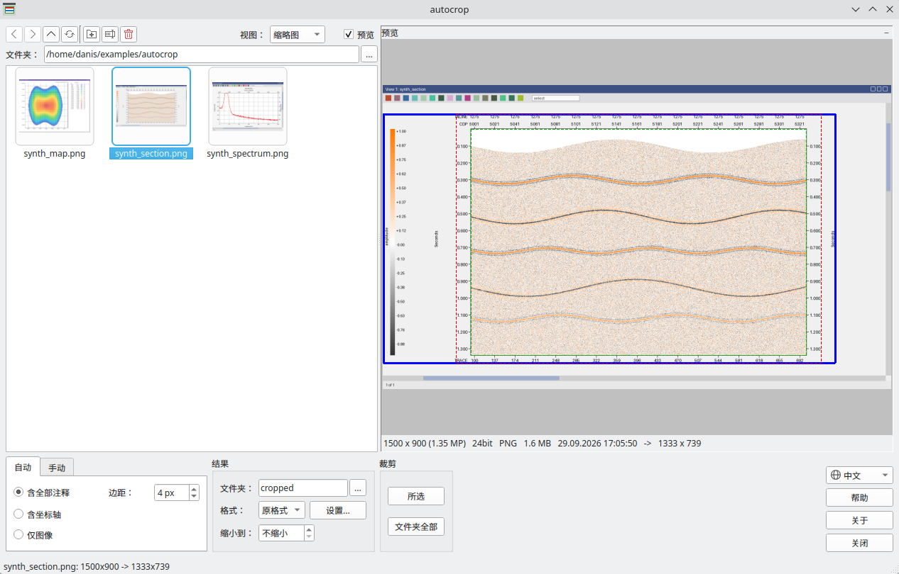
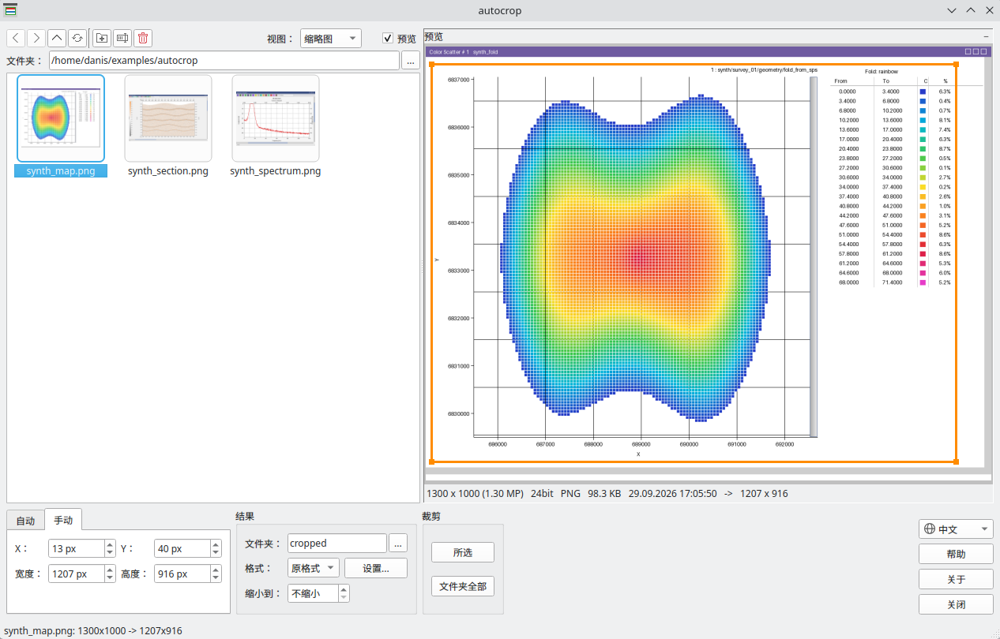

# autocrop

**批量自动裁剪截图**

在准备报告和演示材料时，这个工具可以批量处理截图。它适用于道集、剖面、切片、示意图、平面图和频谱的图像。

程序为每个文件自动确定有用图像的区域：去掉窗口标题、工具栏、滚动条、状态栏和空白边。裁剪边框对每张截图分别计算，
因此同一个文件夹中可以放不同程序、不同大小的窗口截图。

输出为以下三种之一的成品图片：

- 仅图像；
- 含坐标轴的图像；
- 含全部注释的图像：标题、坐标轴名称和色标。

如果所有截图都是在同一窗口、同一比例下截取的，可以手动设置边框：在预览上用鼠标画一次，就会应用到所有文件。
过大的图片可以在保存时按比例缩小到指定尺寸，输出格式可以是 PNG、JPG 或 BMP。

得到的文件可以直接插入报告和演示文稿。



## 下载

[:material-microsoft-windows: Windows](https://github.com/daniscoder/daniscoder.github.io/releases/download/autocrop/autocrop.exe){ .md-button .md-button--primary }
[:material-linux: Linux](https://github.com/daniscoder/daniscoder.github.io/releases/download/autocrop/autocrop){ .md-button }
[:material-linux: Linux（旧系统）](https://github.com/daniscoder/daniscoder.github.io/releases/download/autocrop/autocrop-legacy){ .md-button }

Linux 版适用于 glibc 2.38 或更新版本的系统：Ubuntu 24.04 及更新版本、Debian 13、Fedora 39 及更新版本、
RHEL、Rocky 和 Alma 10。对于更旧的系统 - CentOS 7、RHEL、Rocky 和 Alma 8 与 9、Ubuntu 22.04、Debian 12、
Astra Linux - 有“Linux（旧系统）”版本：它用 Qt5 构建，可以在任何 glibc 2.17 或更新版本的系统上运行
（[详情](index.md#run)）。

当前版本为 1.3。要试用程序，可以下载合成的窗口截图；下面的插图就是用它们制作的：

- [synth_section.png](examples/autocrop/synth_section.png) - 剖面，图像上方有两行标注，两侧有时间刻度，左侧有色标；
- [synth_map.png](examples/autocrop/synth_map.png) - 平面图，左侧和下方有坐标轴，绘图区内有滚动条，右侧有颜色表；
- [synth_spectrum.png](examples/autocrop/synth_spectrum.png) - 频谱，带标题和坐标轴名称。

## 裁剪方式

程序在每张截图上同时找出三个边框，并在预览中显示。所选的方式用粗线绘制。

- **仅图像**（绿色边框） - 只保留数据区，严格沿其边界。如果平面图没有边框，则根据坐标轴和最外侧的数据点确定边界。
  绘图区内的滚动条总会被裁掉。
- **含坐标轴**（红色边框） - 另外保留数据区上方和下方的刻度标注（无论有几行）以及纵轴数值。宽度到这些数值的边缘为止，
  因此左侧的行名称留在外面。
- **含全部注释**（蓝色边框） - 图像周围的一切：标题、坐标轴名称、色标、表格以及平面图上方的标注。


对于含坐标轴和含全部注释的方式，可以设置**边距** - 边框周围留出几个像素的空白。不含坐标轴的图像严格沿边界裁剪，不加边距。

## 手动模式

当所有截图都相同 - 同一窗口、同一比例 - 时，自己设置边框更方便。在“手动”选项卡中以截图像素输入矩形：X、Y、
宽度和高度。每个文件都裁剪这个矩形，超出截图的部分直接舍去。

最简单的方法是直接在预览上用鼠标画边框：拖动边或角改变大小，从内部拖动来移动，在边框外单击则重新开始画。
方向键每次移动边框 10 像素，按住 Shift 每次移动 1 像素。



## 结果与缩小

裁剪后的截图以相同的文件名保存到结果文件夹。默认是截图旁的 `cropped` 文件夹，也可以选择任意文件夹。
如果文件夹框留空，结果放在原文件旁，文件名后加 `_cr`。程序从不覆盖原始截图。

输出格式与截图相同，或为 PNG、JPG、BMP。窗口截图最适合用 PNG：文件更小且无损。“设置...”窗口中的
“256 色调色板”复选框能让 PNG 再小 2-4 倍。JPG 质量也在那里设置：低于 85 时小字会明显模糊。

“缩小到”选项限制结果的长边：如果图片大于指定尺寸，就按比例缩小。裁剪和缩小后的最终尺寸显示在预览下方。

可以处理所选截图，也可以一次处理文件夹中的所有截图。处理在处理器的所有核心上并行进行。

## 文件操作

窗口左侧是文件夹浏览器。截图可以显示为缩略图、列表，或带图像尺寸、文件大小和日期的详细信息列表。
双击打开文件夹。

文件和文件夹可以复制、剪切和粘贴（也可以在程序和资源管理器之间进行）、重命名（F2）、删除到回收站，还可以新建文件夹。
所有操作都可以通过列表上方的按钮、右键菜单和常用快捷键完成。

## 命令行

带参数启动时，程序不打开窗口。这便于在脚本中进行处理：

```
autocrop screenshot.png folder_with_screenshots -k axes -f png -o cropped
```

主要选项：

- `-k all|axes|image` - 裁剪方式：含全部注释、含坐标轴或仅图像；
- `-o` - 结果文件夹；`-o ""` - 放在截图旁，文件名加 `_cr`；
- `-f png|jpg|bmp` - 输出格式；
- `-m` - 边距；
- `-q` - JPG 质量，`--palette` - 带 256 色调色板的 PNG；
- `--box X Y W H` - 手动模式：从所有截图中裁剪这个矩形；
- `--max-side` - 缩小到指定的长边尺寸。

`autocrop -h` 输出全部选项。

## 版本历史

| 版本 | 新内容 |
|---|---|
| 1.3 | 中文界面（简体）：语言跟随系统，也可以在窗口中切换 |
| 1.2 | 英文界面：语言跟随系统，也可以在窗口中切换 |
| 1.1 | 手动裁剪：所有截图使用同一个矩形，可在预览中用鼠标或方向键设置；按长边缩小；格式设置有单独的窗口 |
| 1.0 | 第一版：三种裁剪级别、带文件浏览器和边框预览的窗口、在所有核心上批量处理、命令行模式 |
