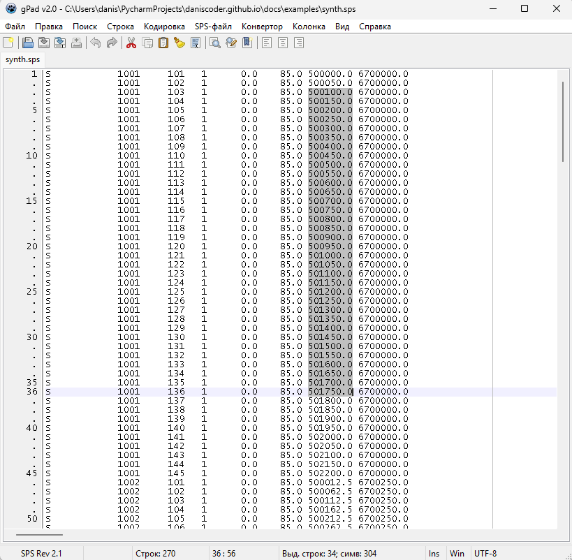

# gPad

Текстовый редактор для сейсморазведчика: все, что нужно для обычного текста,
плюс режим работы с колонками и инструменты для файлов SPS. Колоночные форматы -
SPS, скорости, статики, координаты - правятся колонкой целиком, а не строка за
строкой.



## Скачать

[:material-microsoft-windows: Windows](https://github.com/daniscoder/daniscoder.github.io/releases/download/gPad/gPad.exe){ .md-button .md-button--primary }
[:material-linux: Linux](https://github.com/daniscoder/daniscoder.github.io/releases/download/gPad/gPad){ .md-button }

Версия 2.0. Установки нет: один файл, как и остальные программы на
сайте. Пример для пробы - [synth.sps](examples/synth.sps), на нем снят скрин.

Linux-версия запускается даже на старых системах вроде CentOS 7, но ей нужна
библиотека GTK2. На компьютере с рабочим столом она обычно уже есть; если нет:

```bash
sudo apt install libgtk2.0-0t64   # Ubuntu 24.04, Debian 13
sudo apt install libgtk2.0-0      # Ubuntu 22.04, Debian 12
sudo yum install gtk2             # CentOS, RHEL, Rocky, Alma
```

## Текст

- Несколько файлов во вкладках, недавние файлы, открытие нескольких файлов в
  одну страницу.
- Кодировки, концы строк Windows, Unix и Mac.
- Поиск и замена, в том числе регулярными выражениями и в выделенном.
- Закладки: десять нумерованных и свободные; удалить все строки с закладкой или
  без нее.
- Сортировка строк, в том числе многоуровневая по колонкам.
- Удаление пустых строк, дубликатов, строк по маске; смена регистра; разбиение
  большого файла на части.

## Колонки

Режим колонки и блоковое выделение - то, чего не хватает обычным редакторам на
колоночных форматах.

- Вставить, удалить, вырезать, сместить колонку; выровнять ее влево, вправо или
  по центру.
- Вставить нумерацию: первый номер, шаг, ведущие нули.
- Арифметика над колонкой и сводка по ней: количество, минимум, максимум,
  среднее, сумма.
- Колонка из буфера обмена; разложить текст с разделителями по колонкам
  фиксированной ширины.
- Выбрать строки по значениям колонки.

## SPS

- Формат SPS настраивается: ревизия, позиции полей, символ комментария. Есть
  стандартные форматы Rev 0 и Rev 2.1 и перевод между ними.
- Сортировка, поиск текущего ПВ в файлах S и X, выделение и очистка колонок
  SPS R, S и X.
- Работа с шапками: убрать комментарий, привести к стандарту, вставить
  дополнительную информацию - юлианский день, время, индексы, коды.
- Проверка нумерации: унифицировать номера записей, показать пропущенные.
- Удаление перестрелов ПВ.
- SPS S и R из SPS X; SPS R и S для 2D по координатам точек излома профиля.
- База данных ПП и ПВ: импорт из текста, Excel или буфера обмена, экспорт туда
  же. Из нее обновляются SPS-файлы: координаты из топографических данных,
  статические поправки, глубины и вертикальные времена скважин, расстановки 2D.
- Экспорт в библиотеку Geocluster.

## Скорости

Конвертор скоростных форматов: LVI, Handvel, V5 - в любую сторону.

## История версий

| Версия | Что нового |
|---|---|
| 2.0 | Переписана на Free Pascal в Lazarus: Windows и Linux, 64 бита |
| 1.5 | Версия на Delphi, только Windows, 32 бита |

Старая версия 1.5.61 с установщиком для 32-битной Windows:
[Setup_gPad_v1.5.61.exe](https://github.com/daniscoder/daniscoder.github.io/releases/download/gPad/Setup_gPad_v1.5.61.exe).
Она больше не поддерживается и не обновляется - берите ее, только если в 2.0
чего-то не хватает.

Недостающее в 2.0 при необходимости можно добавить - напишите, чего не хватает
([контакты](author.md#contacts)).
