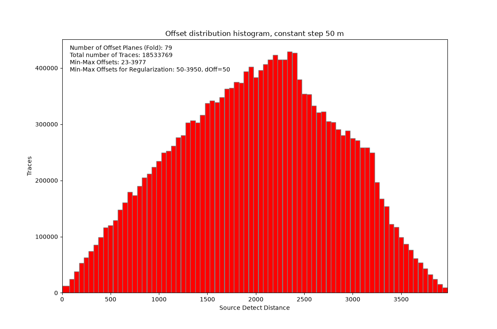
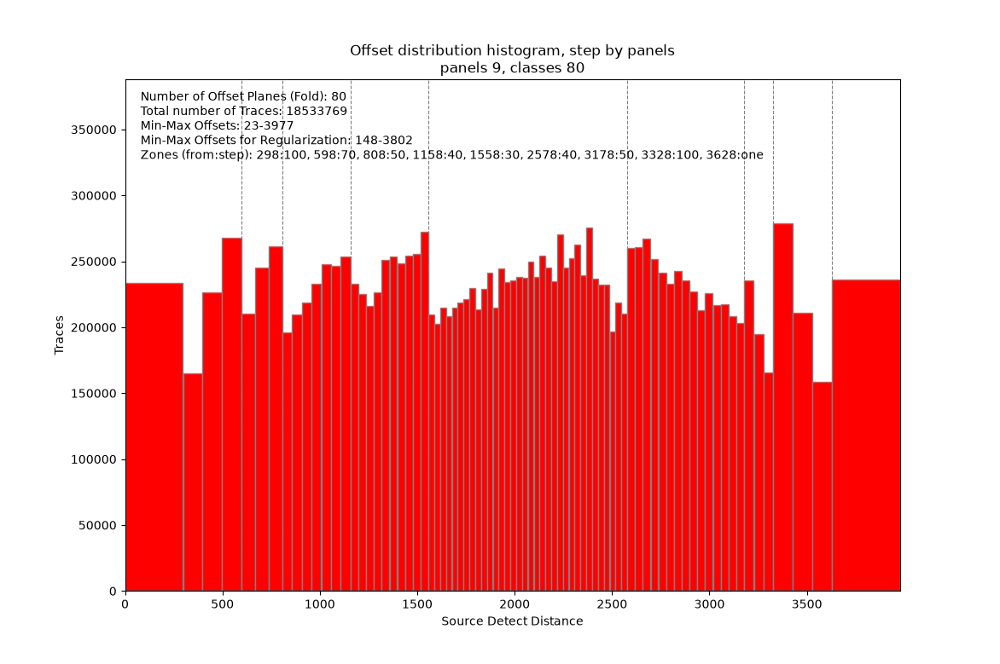

# histogram_for_reg

**Offset distribution analysis for 3D regularization**

The utility builds an offset distribution histogram and is meant for planning 3D
regularization of seismic data.

The program splits offsets into classes, shows them as a histogram and saves a
table of classes next to the input file. The table can be used as input for 3D
regularization.

Offset classes are built in one of two ways:

- with a constant step - all classes have the same width;
- with a step by panels - offsets are split into panels, the step is constant
  within a panel and changes from panel to panel. The program fits the panels by
  itself so that it gets the requested number of classes and the traces are
  spread over them as evenly as possible.


## Download

[:material-microsoft-windows: Windows](https://github.com/daniscoder/daniscoder.github.io/releases/download/histogram_for_reg/histogram_for_reg.exe){ .md-button .md-button--primary }
[:material-linux: Linux](https://github.com/daniscoder/daniscoder.github.io/releases/download/histogram_for_reg/histogram_for_reg){ .md-button }
[:material-linux: Linux (older systems)](https://github.com/daniscoder/daniscoder.github.io/releases/download/histogram_for_reg/histogram_for_reg-legacy){ .md-button }

The Linux version is for systems with glibc 2.38 or newer: Ubuntu 24.04 and
newer, Debian 13, Fedora 39 and newer, RHEL, Rocky and Alma 10. For older systems -
CentOS 7, RHEL, Rocky and Alma 8 and 9, Ubuntu 22.04, Debian 12, Astra Linux -
there is the "Linux (older systems)" build: it is built with Qt5 and runs on any
system with glibc 2.17 or newer ([details](index.md#run)).

The current version is 1.6.0. To try the program, you can download synthetic
offset distributions: [synth_offsets_1.txt](examples/synth_offsets_1.txt) (the
illustrations below are made from it) and
[synth_offsets_2.txt](examples/synth_offsets_2.txt).

## Input data

The input is a text file with two columns: offset (SOURCE_DETECT_DIST) and number
of traces (STACK_WORD). The columns are separated by spaces; how many does not
matter.

```
 SOURCE_DETECT_DIST.G STACK_WORD
            -3976.000          2
            -3975.000          1
            -3974.000          3
```

The first line is skipped only if it does not hold numbers, so a file without a
header is read in full. The sign of an offset shows the side of the shot point,
so offsets are taken in absolute value, and traces with equal offsets are summed.

## Constant step

All classes have the same width. Near offsets can be merged into a first class
several steps wide, and far offsets - into a last class starting from a given
offset.



## Step by panels

Offsets are split into panels: the step is constant within a panel and changes
from panel to panel. Usually the step is coarse at near offsets, fine in the dense
middle and coarser again towards far offsets. Each class gets about the target
number of traces, as with equal-population classes, but the classes within a
panel stay regular. So there are fewer Kirchhoff migration artifacts than when
every class has its own width.



Fitting parameters:

- **Number of offset classes** - how many classes the histogram will have. If the
  other parameters allow it, you get exactly that many; otherwise the program
  warns you and takes the nearest possible number.
- **Base step** - panel steps are fitted as multiples of it. The smaller it is,
  the closer the classes are to equal population, but the longer the fitting
  takes.
- **Max panels** and **Min classes per panel** - limits for the fitting.
- **Step only decreases, then increases** - when checked, the step changes in one
  direction from panel to panel: large at near offsets, small in the dense middle
  and large again towards far offsets. When unchecked, the fitting also allows the
  step to swing: at a dip in the distribution it puts a narrow panel with a large
  step among the small ones.

The "Fit" button fills the panel table "from offset - step" from the data: panels
are found by exhaustive search so that the number of traces in each class deviates
from the target as little as possible. The table can be edited by hand and the
histogram built again.

## Output

The program opens a window with the histogram - it can be zoomed and saved as an
image - and writes a text file next to the input one: `<name>_<step>.txt` for a
constant step and `<name>_step<classes>.txt` for a step by panels. The file has
four columns: the first offset of the class, the last offset, the class center and
the number of traces.

```
    0   36   25   4080
   37   61   50   4089
   62   86   75  12217
```

The window size and the values of all fields are remembered between runs.

## Version history

| Version | What's new |
|---|---|
| 1.6.0 | Step by panels without swinging: the panel step only decreases and then only increases (a checkbox in the window, on by default) |
| 1.5.0 | Chinese interface (Simplified): the language follows the system and can be switched in the window, in Chinese the histogram labels too |
| 1.4.0 | English interface: the language follows the system and can be switched in the window |
| 1.3.0 | Step by panels gives exactly the requested number of classes; later - a Qt5 build for CentOS 7 and other old Linux systems |
| 1.2.0 | "Max offset class width" is a common histogram setting; the variable step is replaced by step by panels |
| 1.1.0 | Step by panels: panels with a constant step, a panel table and its fitting |
| 1.0.0 | First version: constant and variable step |
