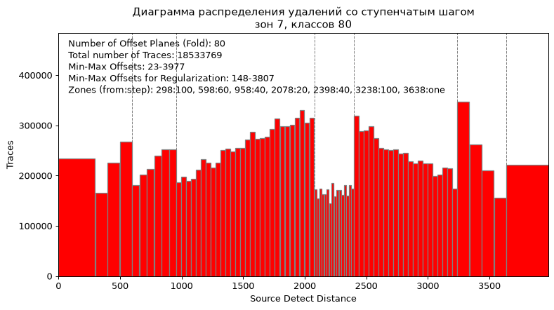
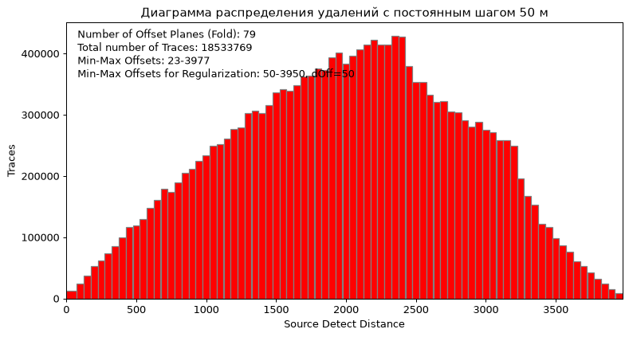

# histogram_for_reg

Диаграмма распределения удалений для планирования регуляризации сейсмических
данных. Программа разбивает удаления на классы, показывает диаграмму и пишет
рядом со входным файлом таблицу классов, которую можно отдать в регуляризацию.



## Скачать

[:material-microsoft-windows: Windows](https://github.com/daniscoder/daniscoder.github.io/releases/download/histogram_for_reg/histogram_for_reg.exe){ .md-button .md-button--primary }
[:material-linux: Linux](https://github.com/daniscoder/daniscoder.github.io/releases/download/histogram_for_reg/histogram_for_reg){ .md-button }

Версия 1.3.0. Примеры для пробы - синтетические распределения удалений:
[synth_offsets_1.txt](examples/synth_offsets_1.txt) (на нем нарисованы картинки
ниже) и [synth_offsets_2.txt](examples/synth_offsets_2.txt).

## Входные данные

Текстовый файл в две колонки: удаление (SOURCE_DETECT_DIST) и количество трасс
(STACK_WORD). Разделитель - пробелы, их количество не важно.

```
 SOURCE_DETECT_DIST.G STACK_WORD
            -3976.000          2
            -3975.000          1
            -3974.000          3
```

Первая строка пропускается, только если это не числа, - файл без шапки читается
целиком. Знак удаления означает сторону от пункта взрыва, поэтому удаления
берутся по модулю, а одинаковые суммируются.

## Постоянный шаг

Классы одинаковой ширины. Ближние удаления можно собрать в первый класс шириной
в несколько шагов, дальние - в последний класс от заданного удаления.



## Ступенчатый шаг

Удаления делятся на зоны: внутри зоны шаг постоянный, от зоны к зоне меняется -
у ближних удалений крупный, в плотной середине мелкий, к дальним снова крупнее.
Трасс в классах около целевого числа, как у классов равной населенности, но
классы внутри зоны регулярные - и артефактов миграции Кирхгофа меньше, чем когда
ширина своя у каждого класса.

- **Количество классов удалений** - сколько классов будет на диаграмме. Классов
  выходит ровно столько, если позволяют остальные параметры; иначе программа
  предупредит и возьмет ближайшее.
- **Базовый шаг** - шаги зон подбираются кратными ему. Чем он меньше, тем ближе
  классы к равной населенности, но тем дольше подбор.
- **Зон не больше**, **классов в зоне не меньше** - ограничения на подбор.

Кнопка «Подобрать» заполняет таблицу зон «от удаления - шаг» по данным: зоны
подбираются перебором так, чтобы трассы в классах как можно меньше отходили от
цели. Таблицу можно поправить руками и построить заново.

## Результат

Окно с диаграммой - ее можно приблизить и сохранить картинкой - и текстовый файл
рядом со входным: `<имя>_<шаг>.txt` для постоянного шага,
`<имя>_step<классы>.txt` для ступенчатого. В нем четыре колонки: первое удаление
класса, последнее, центр класса и количество трасс.

```
    0   36   25   4080
   37   61   50   4089
   62   86   75  12217
```

Размер окна и все поля запоминаются между запусками.

## История версий

| Версия | Что нового |
|---|---|
| 1.3.0 | Ступенчатый шаг дает ровно заданное число классов |
| 1.2.0 | «Макс. ширина класса удаления» - общая настройка диаграммы; переменный шаг заменен ступенчатым |
| 1.1.0 | Ступенчатый шаг: зоны с постоянным шагом, таблица зон и ее подбор |
| 1.0.0 | Первая версия: постоянный и переменный шаг |
