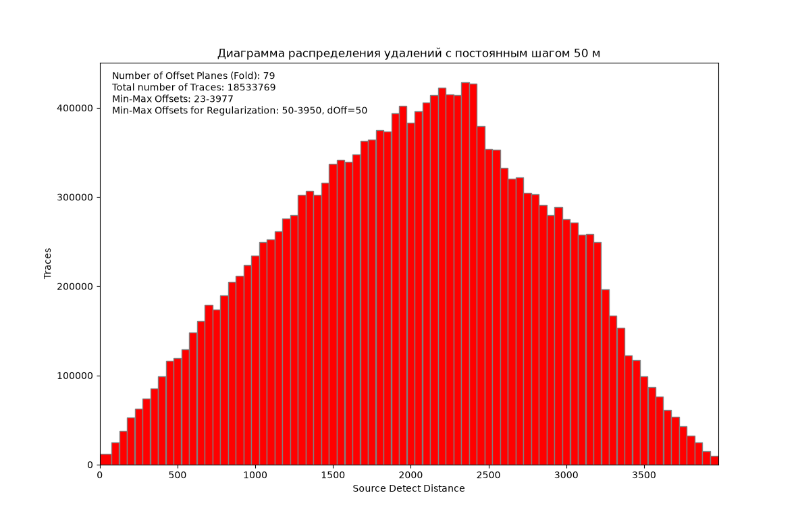
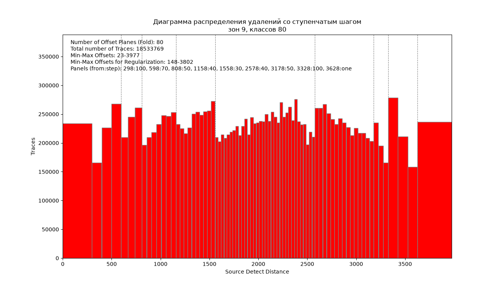

# histogram_for_reg

**Анализ распределения удалений для регуляризации 3D**

Утилита строит диаграмму распределения удалений и предназначена для планирования
регуляризации 3D-сейсмических данных.

Программа разбивает удаления на классы, отображает их в виде диаграммы и
сохраняет рядом с входным файлом таблицу классов. Полученную таблицу можно
использовать в качестве входных данных для регуляризации 3D.

Классы удалений строятся одним из двух способов:

- с постоянным шагом - все классы одинаковой ширины;
- со ступенчатым шагом - удаления делятся на зоны, внутри зоны шаг постоянный, а
  от зоны к зоне меняется. Зоны программа подбирает сама так, чтобы получилось
  заданное число классов, а трассы распределились по ним как можно равномернее.


## Скачать

[:material-microsoft-windows: Windows](https://github.com/daniscoder/daniscoder.github.io/releases/download/histogram_for_reg/histogram_for_reg.exe){ .md-button .md-button--primary }
[:material-linux: Linux](https://github.com/daniscoder/daniscoder.github.io/releases/download/histogram_for_reg/histogram_for_reg){ .md-button }
[:material-linux: Linux (старые системы)](https://github.com/daniscoder/daniscoder.github.io/releases/download/histogram_for_reg/histogram_for_reg-legacy){ .md-button }

Linux-версия рассчитана на системы с glibc 2.38 и новее: Ubuntu 24.04 и новее,
Debian 13, Fedora 39 и новее, RHEL, Rocky и Alma 10. Для более старых систем -
CentOS 7, RHEL, Rocky и Alma 8 и 9, Ubuntu 22.04, Debian 12, Astra Linux - есть
сборка «Linux (старые системы)»: она собрана на Qt5 и запускается на любой
системе с glibc 2.17 и новее ([подробнее](index.md#run)).

Текущая версия - 1.4.0. Чтобы попробовать программу, можно скачать синтетические
распределения удалений: [synth_offsets_1.txt](examples/synth_offsets_1.txt) (на
нем сделаны иллюстрации ниже) и [synth_offsets_2.txt](examples/synth_offsets_2.txt).

## Входные данные

На вход подается текстовый файл в две колонки: удаление (SOURCE_DETECT_DIST) и
количество трасс (STACK_WORD). Колонки разделены пробелами, их число не важно.

```
 SOURCE_DETECT_DIST.G STACK_WORD
            -3976.000          2
            -3975.000          1
            -3974.000          3
```


Первая строка пропускается, только если в ней не числа, поэтому файл без
заголовка читается целиком. Знак удаления означает сторону от пункта
возбуждения, так что удаления берутся по модулю, а трассы с одинаковым удалением
суммируются.

## Постоянный шаг

Все классы имеют одинаковую ширину. Ближние удаления можно собрать в первый класс
шириной в несколько шагов, а дальние - в последний класс, начиная с заданного
удаления.



## Ступенчатый шаг

Удаления делятся на зоны: внутри зоны шаг постоянный, а от зоны к зоне он
меняется. Обычно у ближних удалений шаг крупный, в плотной середине мелкий, а к
дальним снова крупнее. В каждом классе получается примерно целевое число трасс,
как при классах равной населенности, но классы внутри зоны остаются регулярными.
Поэтому артефактов миграции Кирхгофа меньше, чем когда у каждого класса своя
ширина.



Параметры подбора:

- **Количество классов удалений** - сколько классов будет на диаграмме. Если
  остальные параметры позволяют, классов получается ровно столько; иначе
  программа предупредит и возьмет ближайшее возможное число.
- **Базовый шаг** - шаги зон подбираются кратными ему. Чем он меньше, тем ближе
  классы к равной населенности, но тем дольше идет подбор.
- **Зон не больше** и **классов в зоне не меньше** - ограничения на подбор.

Кнопка «Подобрать» заполняет таблицу зон «от удаления - шаг» по данным: зоны
подбираются перебором так, чтобы число трасс в классах как можно меньше
отклонялось от целевого. Таблицу можно поправить вручную и построить диаграмму
заново.

## Результат

Программа открывает окно с диаграммой - ее можно приблизить и сохранить
картинкой - и записывает текстовый файл рядом с входным: `<имя>_<шаг>.txt` для
постоянного шага и `<имя>_step<классы>.txt` для ступенчатого. В файле четыре
колонки: первое удаление класса, последнее удаление, центр класса и количество
трасс.

```
    0   36   25   4080
   37   61   50   4089
   62   86   75  12217
```


Размер окна и значения всех полей запоминаются между запусками.

## История версий

| Версия | Что нового |
|---|---|
| 1.4.0 | Английский интерфейс: язык берется из системы и переключается списком в окне |
| 1.3.0 | Ступенчатый шаг дает ровно заданное число классов; позже - сборка на Qt5 для CentOS 7 и других старых Linux |
| 1.2.0 | «Макс. ширина класса удаления» - общая настройка диаграммы; переменный шаг заменен ступенчатым |
| 1.1.0 | Ступенчатый шаг: зоны с постоянным шагом, таблица зон и ее подбор |
| 1.0.0 | Первая версия: постоянный и переменный шаг |
