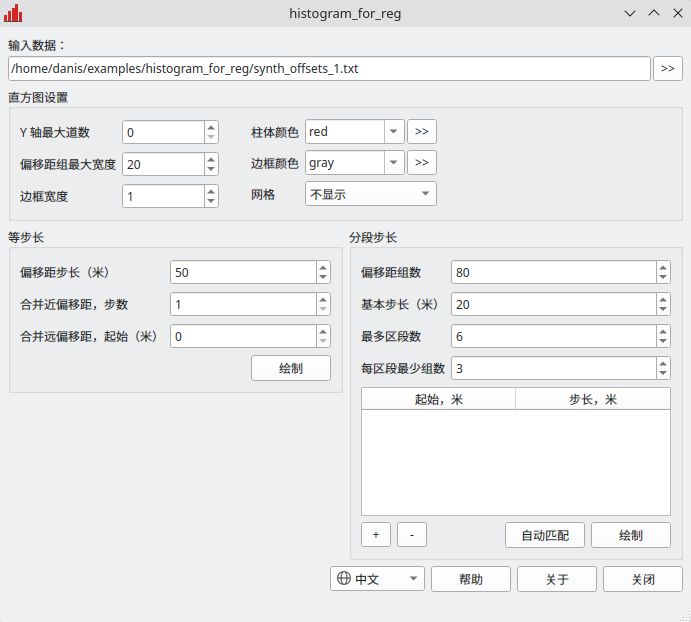
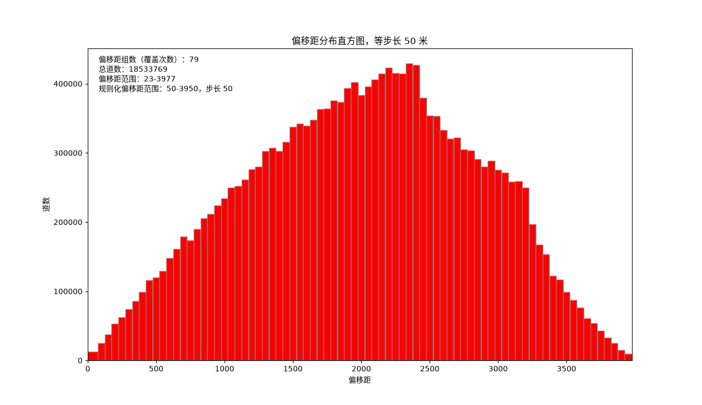
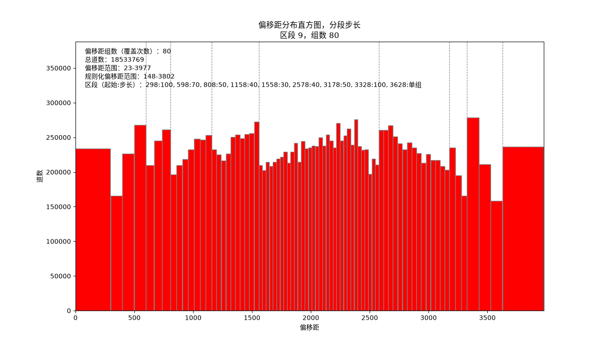

# histogram_for_reg

**用于三维规则化的偏移距分布分析**

这个工具绘制偏移距分布直方图，用于规划三维地震数据的规则化。

程序将偏移距划分为组，以直方图显示，并在输入文件旁保存分组表。这个表可以用作三维规则化的输入数据。

偏移距分组有两种方式：

- 等步长 - 所有组宽度相同；
- 分段步长 - 偏移距被划分为若干区段，区段内步长不变，区段之间步长变化。程序会自动选取区段，
  使组数等于指定值，并使各组道数尽量均匀。



## 下载

[:material-microsoft-windows: Windows](https://github.com/daniscoder/daniscoder.github.io/releases/download/histogram_for_reg/histogram_for_reg.exe){ .md-button .md-button--primary }
[:material-linux: Linux](https://github.com/daniscoder/daniscoder.github.io/releases/download/histogram_for_reg/histogram_for_reg){ .md-button }
[:material-linux: Linux（旧系统）](https://github.com/daniscoder/daniscoder.github.io/releases/download/histogram_for_reg/histogram_for_reg-legacy){ .md-button }

Linux 版适用于 glibc 2.38 或更新版本的系统：Ubuntu 24.04 及更新版本、Debian 13、Fedora 39 及更新版本、
RHEL、Rocky 和 Alma 10。对于更旧的系统 - CentOS 7、RHEL、Rocky 和 Alma 8 与 9、Ubuntu 22.04、Debian 12、
Astra Linux - 有“Linux（旧系统）”版本：它用 Qt5 构建，可以在任何 glibc 2.17 或更新版本的系统上运行
（[详情](index.md#run)）。

当前版本为 1.5.0。要试用程序，可以下载合成的偏移距分布：[synth_offsets_1.txt](examples/synth_offsets_1.txt)
（下面的插图就是用它制作的）和 [synth_offsets_2.txt](examples/synth_offsets_2.txt)。

## 输入数据

输入是两列的文本文件：偏移距（SOURCE_DETECT_DIST）和道数（STACK_WORD）。各列以空格分隔，数量不限。

```
 SOURCE_DETECT_DIST.G STACK_WORD
            -3976.000          2
            -3975.000          1
            -3974.000          3
```

只有当第一行不是数字时才会跳过它，因此没有表头的文件会被完整读取。偏移距的符号表示位于激发点的哪一侧，
所以偏移距取绝对值，偏移距相同的道数会累加。

## 等步长

所有组宽度相同。近偏移距可以合并为宽度为若干步长的第一组，远偏移距可以从指定的偏移距起合并为最后一组。



## 分段步长

偏移距被划分为区段：区段内步长不变，区段之间步长变化。通常近偏移距步长大，道数密集的中部步长小，远偏移距又变大。
每组的道数都接近目标值，与等道数分组相似，但区段内的组是规则的。因此克希霍夫偏移的假象比每组宽度各不相同时更少。



匹配参数：

- **偏移距组数** - 直方图上有多少组。如果其他参数允许，就正好是这个数；否则程序会给出提示并取最接近的值。
- **基本步长** - 各区段步长取其整数倍。它越小，各组道数越接近相等，但匹配时间越长。
- **最多区段数**和**每区段最少组数** - 匹配的限制条件。

“自动匹配”按钮根据数据填写“起始 - 步长”区段表：区段通过穷举选取，使每组道数与目标值的偏差尽量小。
表格可以手动修改，然后重新绘制直方图。

## 结果

程序打开直方图窗口（可以放大并保存为图片），并在输入文件旁写出文本文件：等步长时为 `<name>_<step>.txt`，
分段步长时为 `<name>_step<classes>.txt`。文件有四列：组的第一个偏移距、最后一个偏移距、组中心和道数。

```
    0   36   25   4080
   37   61   50   4089
   62   86   75  12217
```

窗口大小和所有字段的值在两次启动之间保留。

## 版本历史

| 版本 | 新内容 |
|---|---|
| 1.5.0 | 中文界面（简体）：语言跟随系统，也可以在窗口中切换，直方图标注也为中文 |
| 1.4.0 | 英文界面：语言跟随系统，也可以在窗口中切换 |
| 1.3.0 | 分段步长能正好得到指定的组数；后来增加了用于 CentOS 7 及其他旧 Linux 的 Qt5 版本 |
| 1.2.0 | “偏移距组最大宽度”成为直方图的通用设置；可变步长被分段步长取代 |
| 1.1.0 | 分段步长：等步长区段、区段表及其自动匹配 |
| 1.0.0 | 第一版：等步长和可变步长 |
