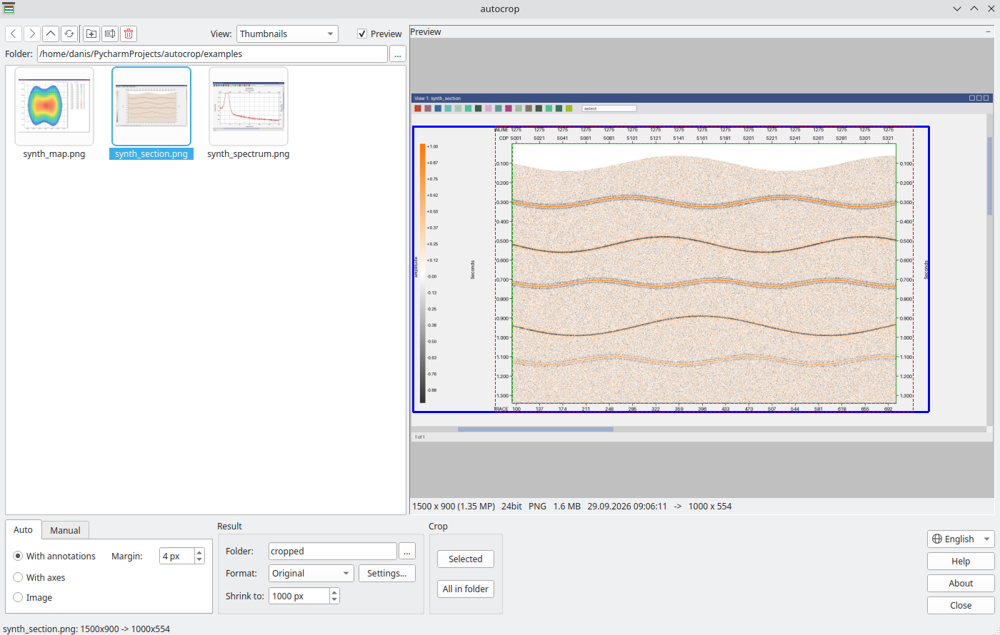
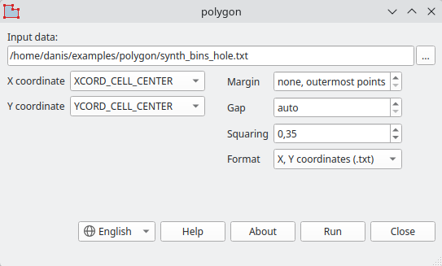
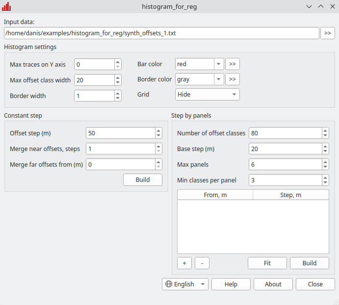

---
hide:
  - toc
---

# Utilities for Seismic Data Processors

Small programs I wrote for my own work with 2D and 3D seismic data. The utilities
automate routine operations and help with three main tasks:

- **present the results** - crop screenshots of sections, maps and spectra for a
  report or a presentation, and a whole folder at once;
- **prepare processing parameters** - build a near-surface model for static
  corrections, the survey boundary polygon, offset classes for 3D regularization;
- **check field data** - fix and cross-check SPS files, assess shooting quality
  from recording listings.

All programs are free and need no installation: each utility is a single file
that you just download and run. Almost all of them are built for Windows and
Linux, including old systems such as CentOS 7. The exception is ListQC, the
earliest of the utilities presented here: it runs on Windows only. If something
does not start, see [How to run](#run) below.

!!! note "Interface language"
    autocrop, lmoToXY, polygon and histogram_for_reg speak English: they follow
    the system language, and the list next to the buttons switches it. gPad and
    ListQC are in Russian so far - menus, buttons, the built-in help and their
    screenshots on this site; where their pages mention a button or a field, its
    Russian caption is given in quotes next to the English name. If needed, a
    program can be localized into any language - [write to me](author.md#contacts).

## Programs { #programs }

<div class="features" markdown>

<div class="feature" markdown>
<div class="feature-text" markdown>

### { .feature-icon } autocrop { #autocrop }

**Automatic batch cropping of screenshots** with gathers, sections, slices, maps
and spectra. For every screenshot the program finds the useful part of the image
by itself and drops the window title, toolbars, scroll bars and empty margins.
The output is **the image only, the image with axes or with all annotations**,
ready for a report or a presentation. There is **a manual mode** for identical
screenshots and **shrinking** for large ones.

[:octicons-arrow-right-24: Learn more](autocrop.md)

</div>
<div class="feature-image" markdown>

[](autocrop.md)

</div>
</div>

<div class="feature" markdown>
<div class="feature-text" markdown>

### { .feature-icon } lmoToXY { #lmotoxy }

**A layered near-surface model from first breaks** to parameterize the static
correction modules Refraction Miser or Refraction Tomo. From LMO data from
PickWorks the program finds **layer boundaries in offsets and layer velocities**
at every shot point and takes the coordinates from SPS.

[:octicons-arrow-right-24: Learn more](lmotoxy.md)

</div>
<div class="feature-image" markdown>

[](lmotoxy.md)

</div>
</div>

<div class="feature" markdown>
<div class="feature-text" markdown>

### { .feature-icon } polygon { #polygon }

**The survey boundary polygon** from a bin export or SPS points: **an outline
through the outermost points** or **an outline with a margin** outward from the
area. If there are several areas, the program finds them by itself and builds **a
polygon for each**. The output is files for processing and **a BLN for
Surfer**.

[:octicons-arrow-right-24: Learn more](polygon.md)

</div>
<div class="feature-image" markdown>

[](polygon.md)

</div>
</div>

<div class="feature" markdown>
<div class="feature-text" markdown>

### { .feature-icon } histogram_for_reg { #histogram_for_reg }

**Offset distribution analysis for 3D regularization.** The program splits
offsets into classes **with a constant step or a step by panels**, shows a
histogram and saves **a table of classes** - ready input for regularization. The
panels of a step by panels are fitted by themselves to the requested number of
classes.

[:octicons-arrow-right-24: Learn more](histogram_for_reg.md)

</div>
<div class="feature-image" markdown>

[](histogram_for_reg.md)

</div>
</div>

<div class="feature" markdown>
<div class="feature-text" markdown>

### { .feature-icon } gPad { #gpad }

**A text editor for geophysicists**: the standard features for plain text and
tools for seismic exploration formats - SPS acquisition geometry, velocity tables,
static corrections and coordinates. Such files are edited **by columns** rather
than line by line; there is **a separate set of functions** for SPS and **a format
converter** for velocities.

[:octicons-arrow-right-24: Learn more](gpad.md)

</div>
<div class="feature-image" markdown>

[](gpad.md)

</div>
</div>

<div class="feature" markdown>
<div class="feature-text" markdown>

### { .feature-icon } ListQC { #listqc }

**Quality control of field shooting** from the attributes in a Geovation or
Geocluster listing. The program rates **every record against the given criteria**
and shows a table with **a quality factor**: you see at once which shot points
fail the check and on which attribute exactly.

[:octicons-arrow-right-24: Learn more](listqc.md)

</div>
<div class="feature-image" markdown>

[](listqc.md)

</div>
</div>

</div>

## How to run { #run }

Download the file for your system from the program's page. Nothing needs to be
installed: you can put the file in any folder and run it from there. On the first
start the program unpacks itself into a temporary folder, so the first start
takes a couple of seconds longer.

**Windows.** Run the `.exe` with a double click. The programs are not signed with
a certificate, so on the first start Windows may show a SmartScreen window
"Windows protected your PC". Click "More info" in it, and then "Run anyway".

**Linux.** You need a system with glibc 2.38 or newer: Ubuntu 24.04 and newer,
Debian 13, Fedora 39 and newer, RHEL, Rocky and Alma 10. On older systems - Ubuntu
22.04, Debian 12, RHEL, Rocky and Alma 8 and 9, Astra Linux - the program will not
start and will print the message ``version `GLIBC_2.38' not found``. You can find
out your glibc version with the `ldd --version` command.

For older systems some programs have a separate build - the "Linux (older
systems)" button on the program's page. It is built with Qt5 on CentOS 7 (glibc
2.17) and runs there and on all newer systems. autocrop, lmoToXY, polygon and
histogram_for_reg have such a build.

On newer systems with Wayland (KDE, GNOME) the build for older systems may show a
generic icon in the window title instead of the program's icon. That is how Qt5
works under Wayland, and it does not affect the program. If it bothers you, run it
through X11:

```bash
QT_QPA_PLATFORM=xcb ./polygon-legacy
```

The Linux program file has no extension. If it came in an archive or was copied
from a Windows network share, the execute permission is lost. Restore it and run
the program:

```bash
chmod +x polygon
./polygon
```

Qt is packed into the file, but the window needs the system graphics libraries. A
desktop computer usually has them already. If the program does not start and says
it cannot load the Qt platform plugin "xcb", install them; on Debian and Ubuntu it
is done like this:

```bash
sudo apt install libgl1 libxkbcommon-x11-0 libxcb-cursor0
```

Every program has a Help button («Справка») with the workflow and a description of
all parameters, and an About button («О программе») with the version number.

## Author

My name is Danis Arslanov, and I am a seismic data processing specialist. I can
write a utility for your task or extend the programs on this site - see
[About the author](author.md).

Email [arslanovdk@gmail.com](mailto:arslanovdk@gmail.com), Telegram
[@ar_dans](https://t.me/ar_dans).
