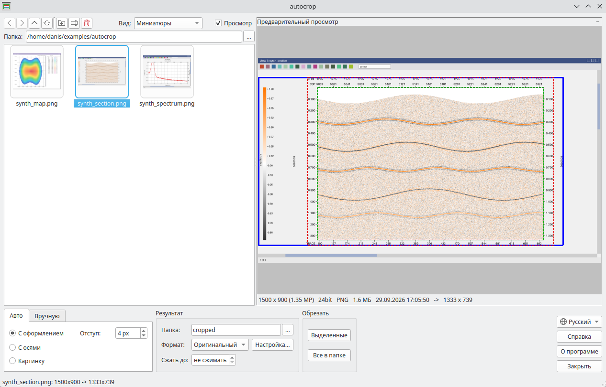
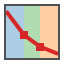
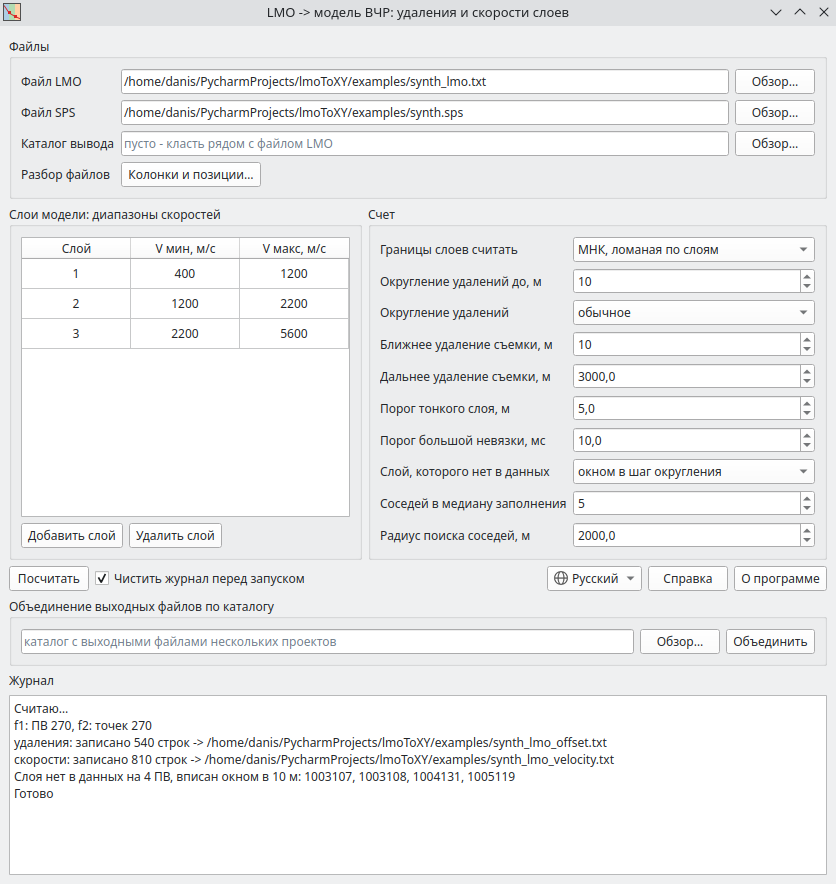
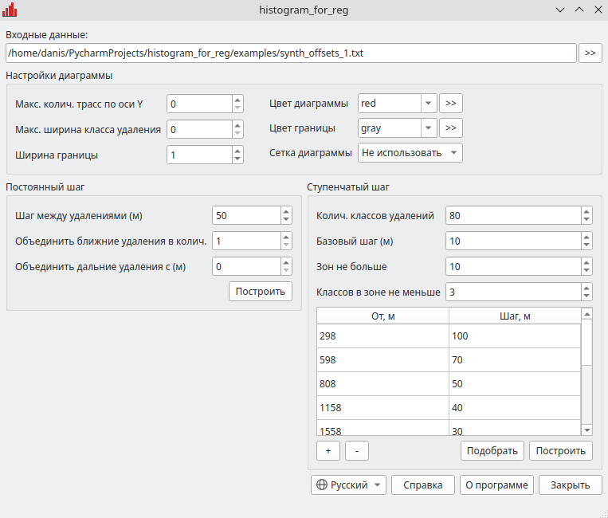
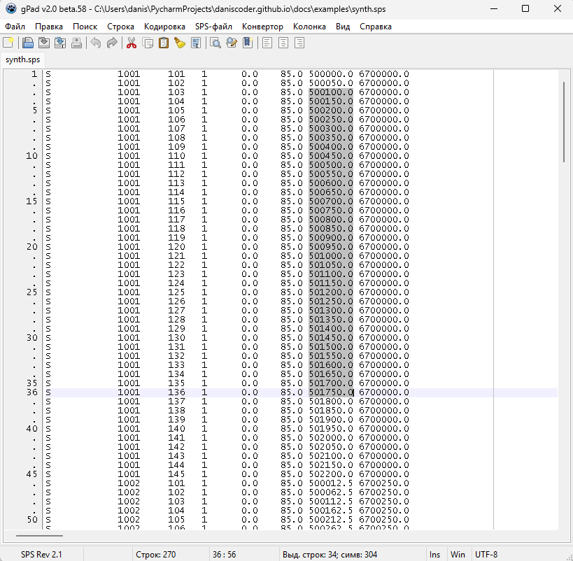
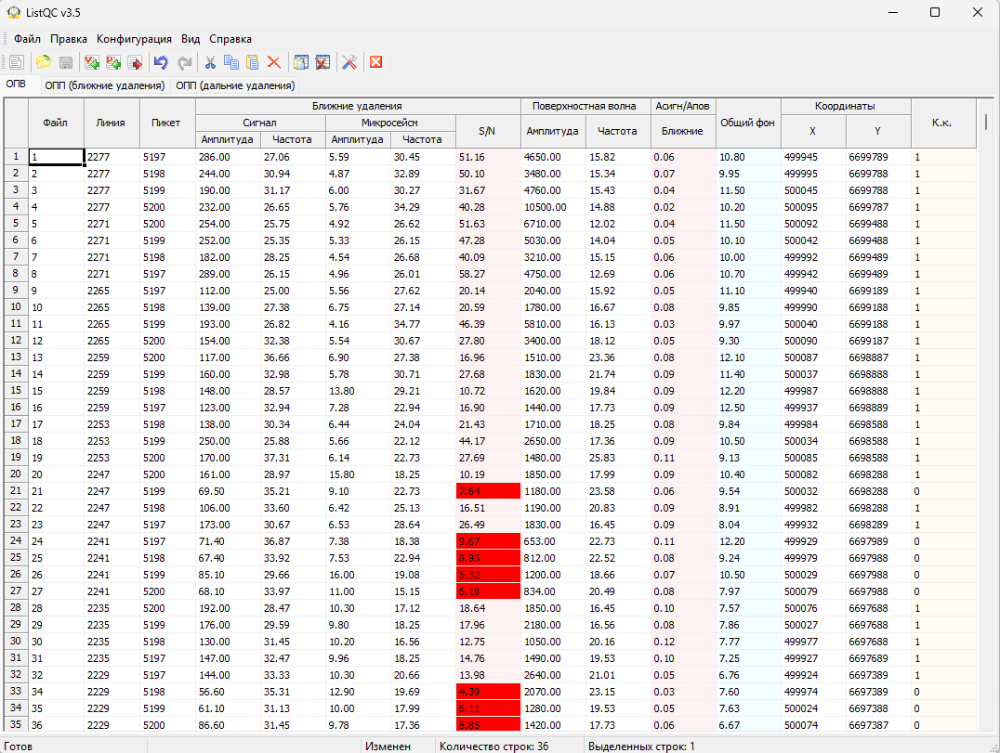

---
hide:
  - toc
---

# Утилиты обработчика сейсмических данных

Небольшие программы, которые я написал для собственной работы с
сейсморазведочными данными 2D и 3D. Утилиты автоматизируют типовые операции и
помогают решать три основные задачи:

- **оформить результат** - обрезать снимки экрана с разрезами, картами и
  спектрами для отчета или презентации, причем сразу целой папкой;
- **подготовить параметры обработки** - построить модель верхней части разреза
  для статических поправок, полигон границы съемки, классы удалений для
  регуляризации 3D;
- **проверить полевые данные** - поправить и сверить файлы SPS, оценить качество
  отстрела по листингам регистрации.

Все программы бесплатные и не требуют установки: каждая утилита представляет
собой один файл, который достаточно скачать и запустить. Почти все собраны для
Windows и Linux, включая старые системы вроде CentOS 7. Исключение - ListQC,
самая ранняя из представленных утилит: она работает только под Windows. Если
что-то не запускается, обратитесь к разделу [«Как запустить»](#run) ниже.

## Программы { #programs }

<div class="features" markdown>

<div class="feature" markdown>
<div class="feature-text" markdown>

### { .feature-icon } autocrop { #autocrop }

**Пакетная автоматическая обрезка скриншотов** с сейсмограммами, разрезами,
слайсами, картами и спектрами. Для каждого снимка программа сама находит область
полезного изображения и отбрасывает заголовок окна, панели, полосы прокрутки и
пустые поля. На выходе - **только изображение, изображение с осями или с полным
оформлением**, готовое для отчета или презентации. Для одинаковых снимков есть
**ручной режим**, для крупных - **сжатие**.

[:octicons-arrow-right-24: Подробнее](autocrop.md)

</div>
<div class="feature-image" markdown>

[](autocrop.md)

</div>
</div>

<div class="feature" markdown>
<div class="feature-text" markdown>

### { .feature-icon } lmoToXY { #lmotoxy }

**Слоистая модель верхней части разреза по первым вступлениям** для
параметризации модулей расчета статических поправок Refraction Miser или
Refraction Tomo. По данным LMO из PickWorks программа на каждом ПВ определяет
**границы слоев в удалениях и скорости слоев**, а координаты берет из SPS.

[:octicons-arrow-right-24: Подробнее](lmotoxy.md)

</div>
<div class="feature-image" markdown>

[](lmotoxy.md)

</div>
</div>

<div class="feature" markdown>
<div class="feature-text" markdown>

### { .feature-icon } polygon { #polygon }

**Полигон границы съемки** по выгрузке бинов или по точкам SPS: **контур по
крайним точкам** или **контур с отступом** наружу от площади. Если площадей
несколько, программа находит их сама и строит **полигон на каждую**. Результат -
файлы для обработки и **BLN для Surfer**.

[:octicons-arrow-right-24: Подробнее](polygon.md)

</div>
<div class="feature-image" markdown>

[](polygon.md)

</div>
</div>

<div class="feature" markdown>
<div class="feature-text" markdown>

### { .feature-icon } histogram_for_reg { #histogram_for_reg }

**Анализ распределения удалений для регуляризации 3D.** Программа разбивает
удаления на классы **с постоянным или ступенчатым шагом**, показывает диаграмму и
сохраняет **таблицу классов** - готовые входные данные для регуляризации. Зоны
ступенчатого шага подбираются сами под заданное число классов.

[:octicons-arrow-right-24: Подробнее](histogram_for_reg.md)

</div>
<div class="feature-image" markdown>

[](histogram_for_reg.md)

</div>
</div>

<div class="feature" markdown>
<div class="feature-text" markdown>

### { .feature-icon } gPad { #gpad }

**Текстовый редактор для геофизика**: стандартные возможности для обычного
текста и инструменты для форматов сейсморазведки - геометрии наблюдений SPS,
таблиц скоростей, статических поправок и координат. Такие файлы редактируются
**по колонкам**, а не строка за строкой; для SPS есть **отдельный набор функций**,
для скоростей - **конвертор форматов**.

[:octicons-arrow-right-24: Подробнее](gpad.md)

</div>
<div class="feature-image" markdown>

[](gpad.md)

</div>
</div>

<div class="feature" markdown>
<div class="feature-text" markdown>

### { .feature-icon } ListQC { #listqc }

**Контроль качества полевого отстрела** по атрибутам из листинга Geovation или
Geocluster. Программа оценивает **каждое наблюдение по заданным критериям** и
выводит таблицу с **коэффициентом качества**: сразу видно, какие ПВ не проходят
контроль и по какому именно атрибуту.

[:octicons-arrow-right-24: Подробнее](listqc.md)

</div>
<div class="feature-image" markdown>

[](listqc.md)

</div>
</div>

</div>

## Как запустить { #run }

Скачайте со страницы программы файл для своей системы. Устанавливать ничего не
нужно: файл можно положить в любую папку и запускать оттуда. При первом запуске
программа распаковывается во временный каталог, поэтому первый старт занимает на
пару секунд больше.

**Windows.** Запустите `.exe` двойным щелчком. Программы не подписаны
сертификатом, поэтому при первом запуске Windows может показать окно SmartScreen
«Система Windows защитила ваш компьютер». В нем нажмите «Подробнее», а затем
«Выполнить в любом случае».

**Linux.** Нужна система с glibc 2.38 или новее: Ubuntu 24.04 и новее, Debian 13,
Fedora 39 и новее, RHEL, Rocky и Alma 10. На более старых системах - Ubuntu
22.04, Debian 12, RHEL, Rocky и Alma 8 и 9, Astra Linux - программа не запустится
и выведет сообщение ``version `GLIBC_2.38' not found``. Узнать свою версию glibc
можно командой `ldd --version`.

Для старых систем у части программ есть отдельная сборка - кнопка «Linux (старые
системы)» на странице программы. Она собрана на Qt5 в CentOS 7 (glibc 2.17) и
запускается на ней и на всех более новых системах. Такая сборка есть у autocrop,
lmoToXY, polygon и histogram_for_reg.

На новых системах с Wayland (KDE, GNOME) у сборки для старых систем в заголовке
окна может стоять стандартный значок вместо значка программы. Так Qt5 работает
под Wayland, на работу программы это не влияет. Если мешает, запустите ее через
X11:

```bash
QT_QPA_PLATFORM=xcb ./polygon-legacy
```

Файл программы для Linux - без расширения. Если он пришел в архиве или был
скопирован с сетевой папки Windows, право на выполнение теряется. Верните его и
запустите программу:

```bash
chmod +x polygon
./polygon
```

Qt находится внутри файла, но окну нужны системные графические библиотеки. На
компьютере с рабочим столом они обычно уже установлены. Если программа не
запускается и сообщает, что не может загрузить плагин Qt «xcb», установите их; в
Debian и Ubuntu это делается так:

```bash
sudo apt install libgl1 libxkbcommon-x11-0 libxcb-cursor0
```

В каждой программе есть кнопка «Справка» с порядком работы и описанием всех
параметров и кнопка «О программе» с номером версии.

## Автор

Меня зовут Данис Арсланов, я специалист по обработке сейсморазведочных данных.
Могу сделать утилиту под вашу задачу или доработать программы с сайта -
подробнее на странице [Об авторе](author.md).

Почта [arslanovdk@gmail.com](mailto:arslanovdk@gmail.com), Telegram
[@ar_dans](https://t.me/ar_dans).
