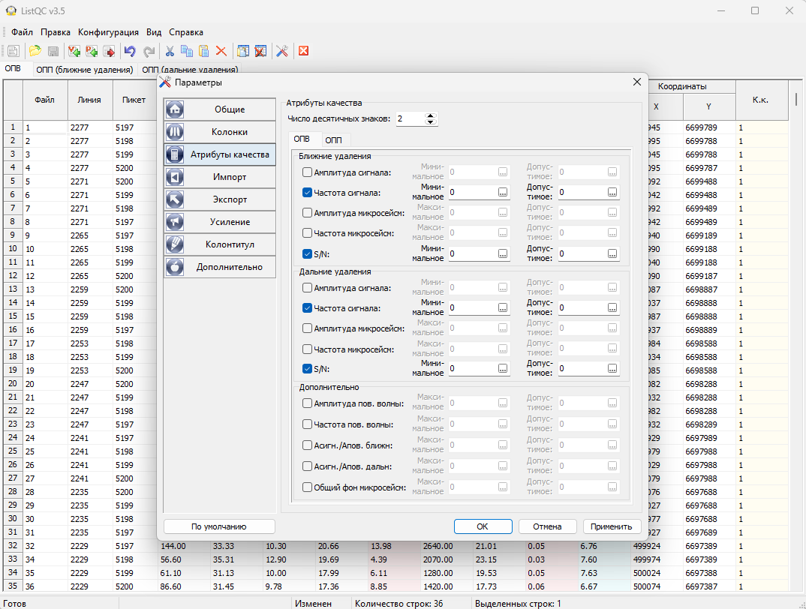
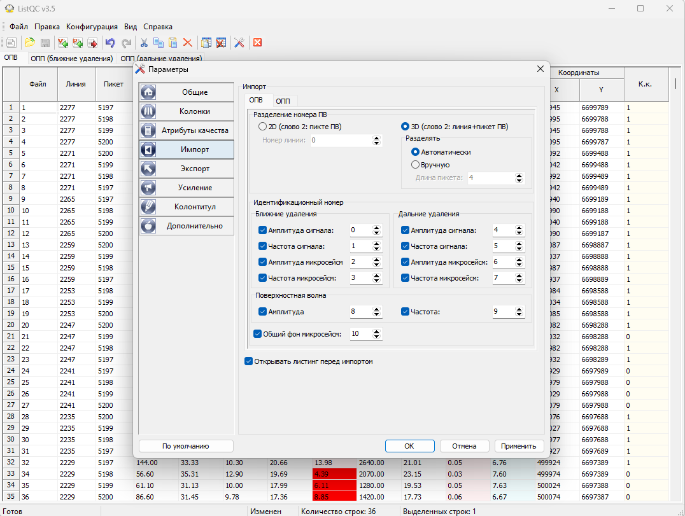
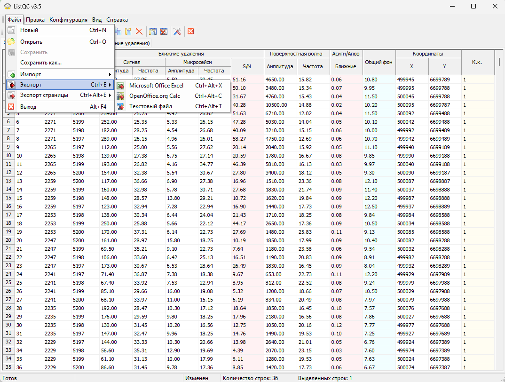
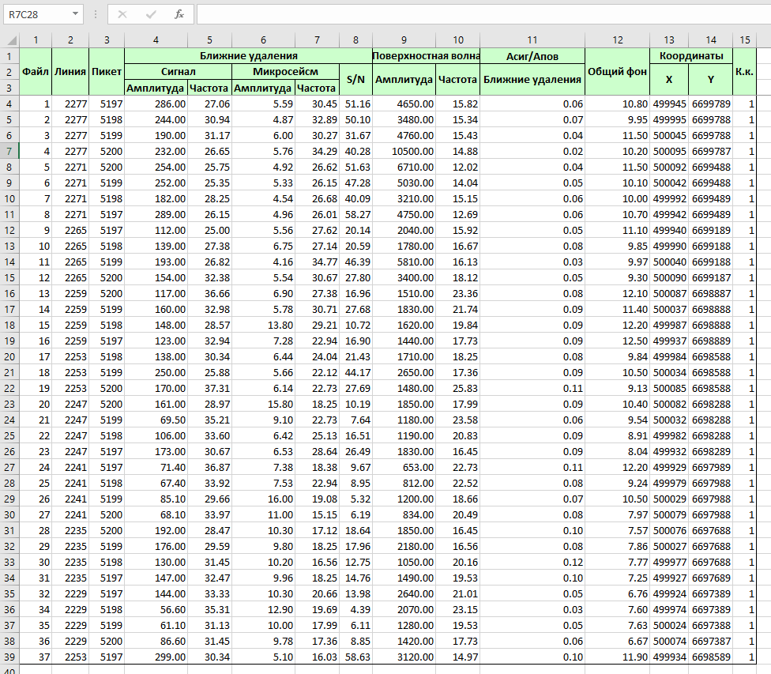

# ListQC

Quality control of field shooting from the attributes computed by the processing
system. The program reads a job listing with quality attributes, rates every
field record against the given criteria and shows a table with a quality factor -
you see at once which shot points fail and on which attribute.

!!! note "A program for older systems"
    ListQC is made for Geovation and Geocluster (CGG): a job in these systems
    computes the attributes, and the program parses their listing. It is no longer
    developed and is published as is.

## Download

[:material-microsoft-windows: Windows](https://github.com/daniscoder/daniscoder.github.io/releases/download/ListQC/ListQC.exe){ .md-button .md-button--primary }

Version 3.5, Windows only: a single file, no installation needed. The program is
32-bit and runs on 64-bit Windows too.

Samples - jobs that compute the attributes and the listings they produce:

| System | Job | Listing |
|---|---|---|
| Geocluster | [Job_Geocluster.xjj](examples/listqc/Job_Geocluster.xjj) | [List_Geocluster.list](examples/listqc/List_Geocluster.list) |
| Geovation | [Job_Geovation.gsl](examples/listqc/Job_Geovation.gsl) | [List_Geovation.list](examples/listqc/List_Geovation.list) |

Server, user and project names and coordinates in the samples are changed.

## Workflow

1. In Geovation or Geocluster, run a job like the samples: it computes the
   quality attributes and writes them to the listing.
2. Import the listing into ListQC: File - Import - Shot point listing or Receiver
   point listing («Файл - Импорт - Листинг ПВ» / «Листинг ПП»).
3. Set the criteria - the program rates every record.
4. Save the result in the program's own format or export it.

## Attributes and criteria

Attributes for near and far offsets: signal amplitude and frequency, ambient
noise amplitude and frequency, signal-to-noise ratio. Additionally - ground roll
amplitude and frequency, signal to ground roll ratio, overall ambient noise level.
Tables - by common shot and by common receiver, separately for near and far
offsets; which columns to show is configurable.

Every attribute has two thresholds: for the signal - the minimum and the
acceptable value, for noise - the maximum and the acceptable value. From them
every record gets a quality factor. An attribute that fails its criterion is
highlighted in the table, and the quality factor of the record becomes 0.

The screenshots on this page mark shot points with S/N below 10 at near offsets
this way.

## Import

The shot point number in the listing is parsed as 2D (station only) or 3D (line
and station, split automatically or by station length). Which attribute sits
under which identification number in the listing is set in the settings; the
listing can be previewed before import.

## Saving and export

The result is saved in the program's own format and can be opened again. Export -
of the whole table or the current page - to Microsoft Excel, OpenOffice.org Calc
or a text file.

In Excel the table gets the same header as in the program:

