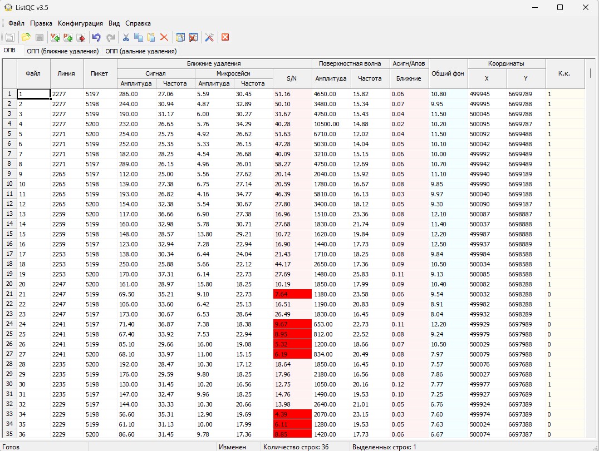
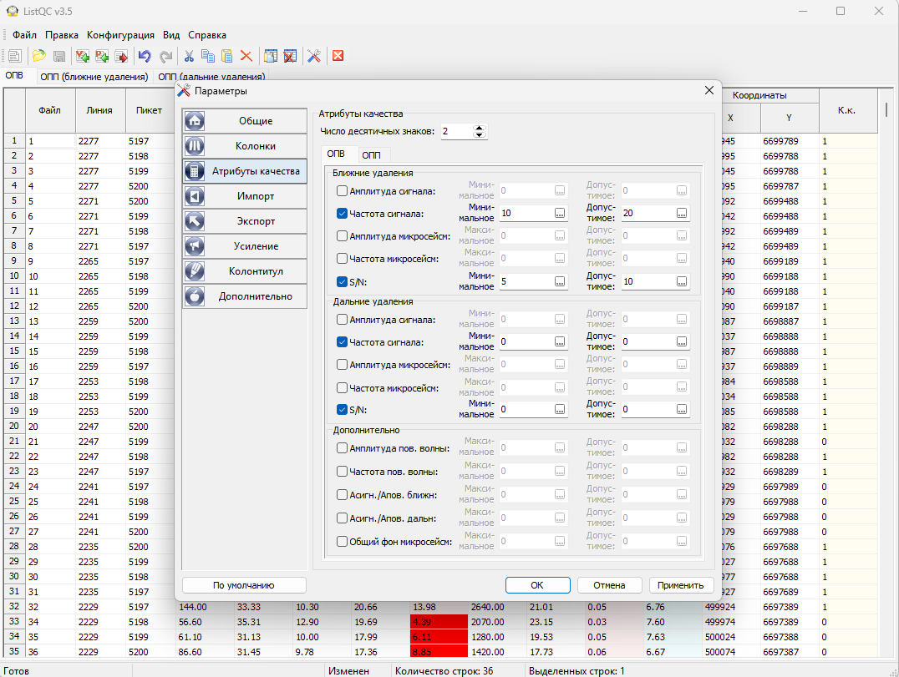
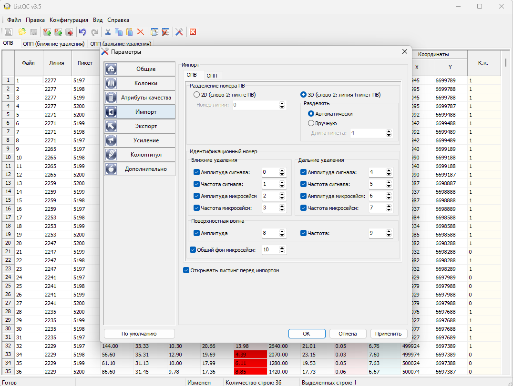
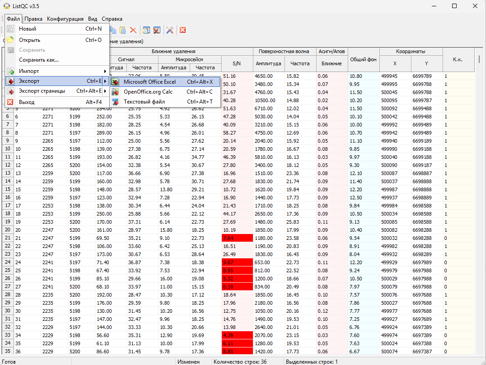
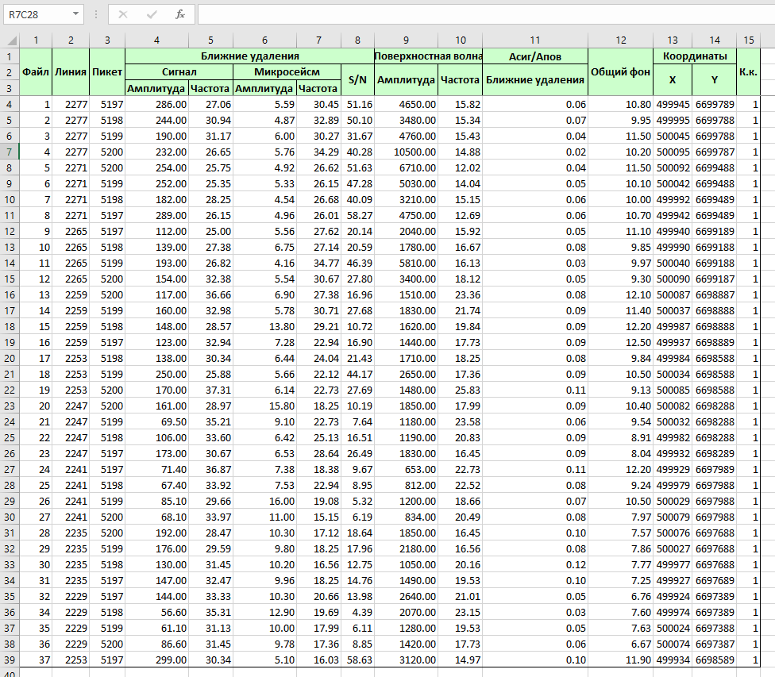

# ListQC

Контроль качества полевого отстрела по атрибутам, которые считает система
обработки. Программа читает листинг задания с атрибутами качества, оценивает
каждое физическое наблюдение по заданным критериям и показывает таблицу с
коэффициентом качества - сразу видно, какие ПВ не проходят и по какому
атрибуту.

!!! note "Программа для старых систем"
    ListQC сделана под Geovation и Geocluster (CGG): атрибуты считает задание в
    этих системах, программа разбирает их листинг. Она больше не развивается и
    выложена как есть.

## Скачать

[:material-microsoft-windows: Windows](https://github.com/daniscoder/daniscoder.github.io/releases/download/ListQC/ListQC.exe){ .md-button .md-button--primary }

Версия 3.5, только Windows: один файл, установка не нужна. Программа 32-битная,
работает и на 64-битной Windows.

Примеры - задания, которые считают атрибуты, и листинги, которые из них
получаются:

| Система | Задание | Листинг |
|---|---|---|
| Geocluster | [Job_Geocluster.xjj](examples/listqc/Job_Geocluster.xjj) | [List_Geocluster.list](examples/listqc/List_Geocluster.list) |
| Geovation | [Job_Geovation.gsl](examples/listqc/Job_Geovation.gsl) | [List_Geovation.list](examples/listqc/List_Geovation.list) |

Имена серверов, пользователей, проектов и координаты в примерах изменены.

## Порядок работы

1. В Geovation или Geocluster запустить задание по образцу из примеров: оно
   считает атрибуты качества и пишет их в листинг.
2. Импортировать листинг в ListQC: «Файл - Импорт - Листинг ПВ» или «Листинг
   ПП».
3. Задать критерии - программа оценит каждое наблюдение.
4. Сохранить результат в своем формате или экспортировать.

## Атрибуты и критерии

Атрибуты по ближним и дальним удалениям: амплитуда и частота сигнала, амплитуда
и частота микросейсм, отношение сигнал/помеха. Дополнительно - амплитуда и
частота поверхностной волны, отношение сигнала к поверхностной волне, общий фон
микросейсм. Таблицы - по ОПВ и по ОПП, отдельно для ближних и дальних удалений;
какие колонки показывать, настраивается.

Для каждого атрибута задаются два порога: для сигнала - минимальное и
допустимое значение, для помех - максимальное и допустимое. По ним каждое
наблюдение получает коэффициент качества. Атрибут, который не прошел
критерий, подсвечивается в таблице, а коэффициент качества наблюдения
становится 0.

На скринах этой страницы так отмечены ПВ, у которых S/N на ближних удалениях
ниже 10.

## Импорт

Номер ПВ в листинге разбирается как 2D (только пикет) или 3D (линия и пикет,
разделение автоматически или по длине пикета). Какой атрибут под каким
идентификационным номером лежит в листинге, задается в настройках; перед
импортом листинг можно просмотреть.

## Сохранение и экспорт

Результат сохраняется в собственном формате программы и открывается снова.
Экспорт - всей таблицы или текущей страницы - в Microsoft Excel, OpenOffice.org
Calc или текстовый файл.

В Excel таблица уходит с той же шапкой, что в программе:

