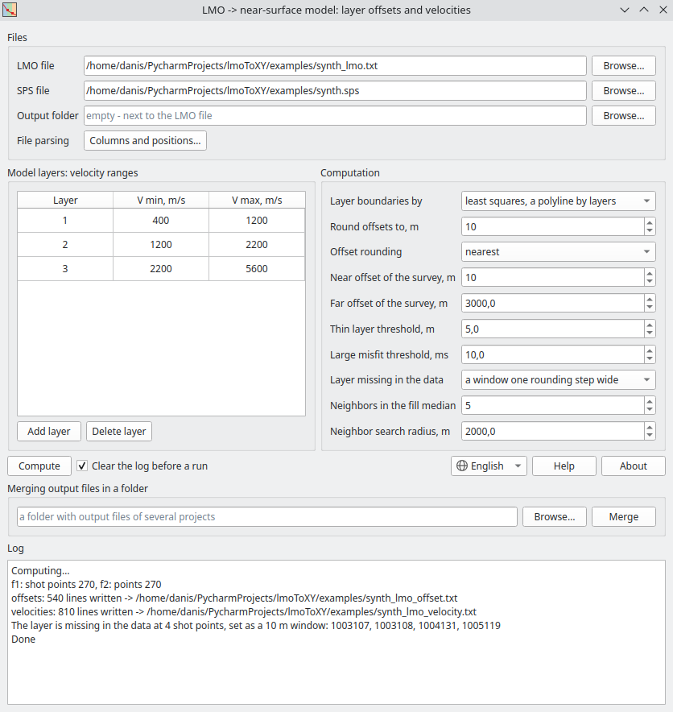

# lmoToXY

Layered near-surface model from first breaks. From an LMO file the program builds
layer boundaries in offsets and layer velocities at every shot point, takes the
X/Y coordinates from SPS and writes two files: layer offsets - for refraction
statics from first breaks - and layer velocities.



## Download

[:material-microsoft-windows: Windows](https://github.com/daniscoder/daniscoder.github.io/releases/download/lmoToXY/lmoToXY.exe){ .md-button .md-button--primary }
[:material-linux: Linux](https://github.com/daniscoder/daniscoder.github.io/releases/download/lmoToXY/lmoToXY){ .md-button }
[:material-linux: Linux (older systems)](https://github.com/daniscoder/daniscoder.github.io/releases/download/lmoToXY/lmoToXY-legacy){ .md-button }

The Linux version is for systems with glibc 2.38 or newer: Ubuntu 24.04+, Debian
13, Fedora 39+, RHEL, Rocky and Alma 10. For older ones - CentOS 7, RHEL, Rocky and
Alma 8 and 9, Ubuntu 22.04, Debian 12, Astra Linux - use the "Linux (older
systems)" build: it is built with Qt5 and runs on any system with glibc 2.17 or
newer ([details](index.md#run)).

Version 1.1.0. Sample data - a synthetic pair: [synth_lmo.txt](examples/synth_lmo.txt)
and [synth.sps](examples/synth.sps), 270 shot points, a three-layer model.

## Input data

**LMO file** - a block of lines per shot point, tab-separated columns: shot point
number, minimum offset, maximum offset, intercept time in ms and velocity in m/s.
The shot point number is given only in the first line of a block; in the other
lines this column is empty and the line starts with a tab:

```
1001101	1.0	238.8	0.00	620.0
	238.8	1305.6	255.00	1835.1
	1305.6	1.0E7	575.67	3341.0
```

The program cannot read a file with space-separated columns.

The lines of a block are pieces of one continuous first-break traveltime curve:
the time at the end of a piece equals the time at the start of the next one.

**SPS file** - shot point records with fixed character positions: 2-17 shot
line, 18-25 shot point, 47-55 X, 56-65 Y. Line and point are joined into the shot
point number, which must match the number in the LMO file. If your crew uses other
columns or positions, change them in the Columns and positions window.

## Computation

A piece of the traveltime curve goes to the layer whose velocity range it falls
into. The layer ranges are set in a table, by default three layers: 400-1200,
1200-2200 and 2200-5600 m/s. Layer boundaries are found in one of two ways:

- **least squares** - the traveltime curve is fitted with a polyline, one line
  per layer;
- **velocity threshold** - the boundary is where the apparent velocity crosses
  the middle of the gap between the ranges of adjacent layers.

The number of layers is the same at every shot point: a layer missing in the data
at a shot point is filled with a window one rounding step wide, from neighboring
shot points, or by fitting all layers. The computation runs in the background,
progress and results go to the log.

## Result

Two files in the output folder or next to the LMO file, in blocks by layer:

```
<name>_offset.txt:    <layer> <X> <Y> <min.offset> <max.offset>   from layer 2
<name>_velocity.txt:  <layer> <X> <Y> <velocity>                  from layer 1
```

Files of several projects in one folder are merged into one `_offset` and one
`_velocity` with the Merge button; duplicates by coordinates are skipped.

## Version history

| Version | What's new |
|---|---|
| 1.1.0 | English interface: the language follows the system and can be switched in the window |
| 1.0.0 | First version as a separate program: windows in Qt Designer, an icon, help, builds for Windows and Linux; later - a Qt5 build for CentOS 7 and other old Linux systems |
