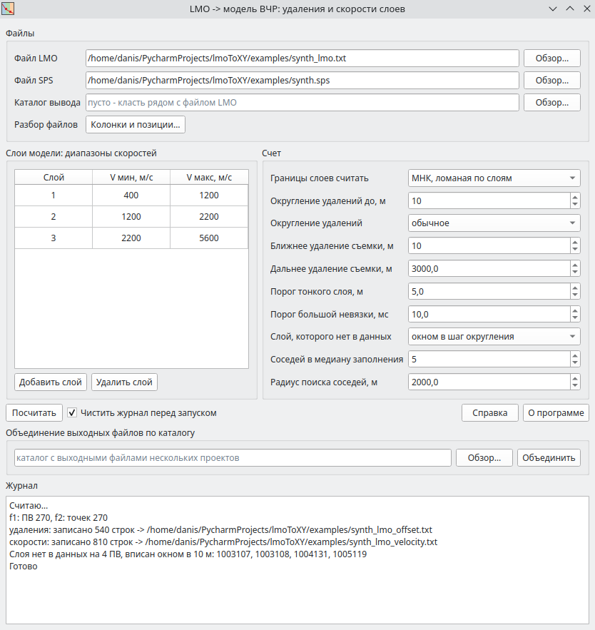

# lmoToXY

Слоистая модель верхней части разреза по первым вступлениям. По файлу LMO
программа на каждом ПВ строит границы слоев в удалениях и скорости слоев,
координаты X/Y берет из SPS и пишет два файла: удаления слоев - для расчета
статики по первым вступлениям - и скорости слоев.



## Скачать

[:material-microsoft-windows: Windows](https://github.com/daniscoder/daniscoder.github.io/releases/download/lmoToXY/lmoToXY.exe){ .md-button .md-button--primary }
[:material-linux: Linux](https://github.com/daniscoder/daniscoder.github.io/releases/download/lmoToXY/lmoToXY){ .md-button }
[:material-linux: Linux (старые системы)](https://github.com/daniscoder/daniscoder.github.io/releases/download/lmoToXY/lmoToXY-legacy){ .md-button }

Linux-версия - для систем с glibc 2.38 и новее: Ubuntu 24.04+, Debian 13,
Fedora 39+. Для более старых - CentOS 7, RHEL, Rocky и Alma 8 и 9, Ubuntu 22.04,
Debian 12, Astra Linux - сборка «Linux (старые системы)»: она на Qt5 и запускается на
любой системе с glibc 2.17 и новее ([подробнее](index.md#run)).

Версия 1.0.0. Пример для пробы - синтетическая пара: [synth_lmo.txt](examples/synth_lmo.txt)
и [synth.sps](examples/synth.sps), 270 ПВ, трехслойная модель.

## Входные данные

**Файл LMO** - блок строк на каждый ПВ, колонки через табуляцию: номер ПВ,
минимальное удаление, максимальное удаление, интерсепт в мс и скорость в м/с.
Номер ПВ только в первой строке блока, в остальных эта колонка пустая и строка
начинается с табуляции:

```
1001101	1.0	238.8	0.00	620.0
	238.8	1305.6	255.00	1835.1
	1305.6	1.0E7	575.67	3341.0
```

Файл с колонками через пробелы программа не прочитает.

Строки блока - куски одного непрерывного годографа первых вступлений: время
конца куска совпадает со временем начала следующего.

**Файл SPS** - записи ПВ с фиксированными позициями символов: 2-17 линия ПВ,
18-25 точка ПВ, 47-55 X, 56-65 Y. Линия и точка склеиваются в номер ПВ, который
должен совпасть с номером в LMO. Если в партии колонки или позиции другие, их
меняют в окне «Колонки и позиции».

## Счет

Кусок годографа достается слою, в чей диапазон скоростей он попадает. Диапазоны
слоев задаются таблицей, по умолчанию три слоя: 400-1200, 1200-2200 и
2200-5600 м/с. Границы слоев подбираются одним из двух способов:

- **МНК** - годограф приближается ломаной, по прямой на слой;
- **порог по скорости** - граница там, где кажущаяся скорость пересекает середину
  зазора между диапазонами соседних слоев.

Число слоев одинаково на всех ПВ: слой, которого на ПВ нет в данных, заполняется
окном в шаг округления, по соседним ПВ или подбором всеми слоями. Счет идет в
фоне, ход и итоги пишутся в журнал.

## Результат

Два файла в каталоге вывода или рядом с файлом LMO, блоками по слоям:

```
<имя>_offset.txt:    <слой> <X> <Y> <мин.удаление> <макс.удаление>   со слоя 2
<имя>_velocity.txt:  <слой> <X> <Y> <скорость>                       со слоя 1
```

Файлы нескольких проектов из одного каталога собираются в один `_offset` и один
`_velocity` кнопкой «Объединить», повторы по координатам пропускаются.

## История версий

| Версия | Что нового |
|---|---|
| 1.0.0 | Первая версия отдельной программой: окна в Qt Designer, иконка, справка, сборка для Windows и Linux; позже - сборка на Qt5 для CentOS 7 и других старых Linux |
