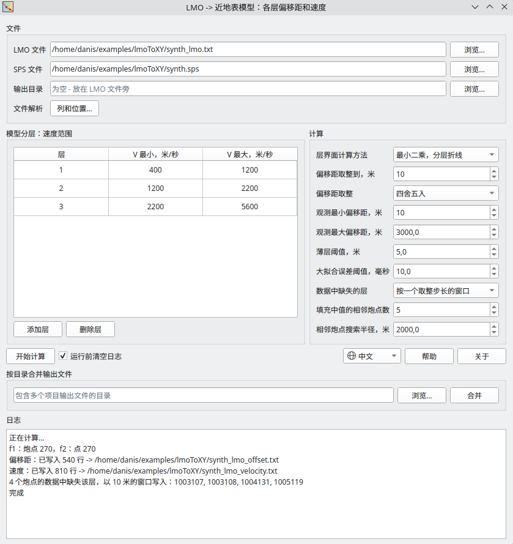

# lmoToXY

**根据初至建立层状近地表模型，用于为静校正计算模块 Refraction Miser 或 Refraction Tomo 设置参数**

这个工具根据初至数据建立层状近地表模型。输入数据是 PickWorks 的 LMO 文件：程序在每个炮点上求出以偏移距表示的层界面，
并计算各层速度。

X/Y 坐标取自 SPS 文件。程序写出两个输出文件：

- 各层偏移距文件 - 用于初至静校正计算；
- 各层速度文件。



## 下载

[:material-microsoft-windows: Windows](https://github.com/daniscoder/daniscoder.github.io/releases/download/lmoToXY/lmoToXY.exe){ .md-button .md-button--primary }
[:material-linux: Linux](https://github.com/daniscoder/daniscoder.github.io/releases/download/lmoToXY/lmoToXY){ .md-button }
[:material-linux: Linux（旧系统）](https://github.com/daniscoder/daniscoder.github.io/releases/download/lmoToXY/lmoToXY-legacy){ .md-button }

Linux 版适用于 glibc 2.38 或更新版本的系统：Ubuntu 24.04 及更新版本、Debian 13、Fedora 39 及更新版本、
RHEL、Rocky 和 Alma 10。对于更旧的系统 - CentOS 7、RHEL、Rocky 和 Alma 8 与 9、Ubuntu 22.04、Debian 12、
Astra Linux - 有“Linux（旧系统）”版本：它用 Qt5 构建，可以在任何 glibc 2.17 或更新版本的系统上运行
（[详情](index.md#run)）。

当前版本为 1.2.0。要试用程序，可以下载一对合成文件：[synth_lmo.txt](examples/synth_lmo.txt) 和
[synth.sps](examples/synth.sps) - 270 个炮点、三层模型。

## 输入数据

**LMO 文件**由若干行块组成，每个炮点一块。各列以制表符分隔：炮点号、最小偏移距、最大偏移距、截距时间（毫秒）
和速度（米/秒）。炮点号只写在块的第一行；其他行中这一列为空，行首是一个制表符：

```
1001101	1.0	238.8	0.00	620.0
	238.8	1305.6	255.00	1835.1
	1305.6	1.0E7	575.67	3341.0
```

这些数据是在 LMO 拾取后从 PickWorks 中复制出来，原样保存为文本文件的：各列必须保持以制表符分隔。

同一块中的各行是一条连续初至时距曲线的各段：一段末端的时间等于下一段起点的时间。

**SPS 文件**包含按固定字符位置排列的炮点记录：炮线 - 第 2-17 位，炮点 - 第 18-25 位，X - 第 47-55 位，
Y - 第 56-65 位。线号和点号合成炮点号，它必须与 LMO 文件中的编号一致。如果本队使用其他列或位置，可以在
“列和位置”窗口中修改。

## 计算

时距曲线的每一段归入其速度所在范围对应的层。速度范围在表格中设置；默认有三层：400-1200、1200-2200 和
2200-5600 米/秒。层界面用以下两种方法之一确定：

- **最小二乘** - 用折线逼近时距曲线，每层一段直线；
- **速度阈值** - 界面位于视速度穿过相邻两层速度范围间隙中点的位置。

所有炮点的层数相同。如果某个炮点的数据中缺失某层，可以用一个取整步长宽的窗口、按相邻炮点填充，或拟合所有层 -
方式在设置中选择。计算在后台进行，进度和结果写入日志。

## 结果

程序写出两个文件 - 放在所选的输出目录或 LMO 文件旁。文件中的数据按层分块：

```
<name>_offset.txt:    <layer> <X> <Y> <min.offset> <max.offset>   从第 2 层开始
<name>_velocity.txt:  <layer> <X> <Y> <velocity>                  从第 1 层开始
```

偏移距文件从第二层开始，速度文件从第一层开始。

如果一个文件夹中有几个项目的结果，“合并”按钮会把它们合并为一个 `_offset` 文件和一个 `_velocity` 文件。
坐标重复的点会被跳过。

## 版本历史

| 版本 | 新内容 |
|---|---|
| 1.2.0 | 中文界面（简体）：语言跟随系统，也可以在窗口中切换 |
| 1.1.0 | 英文界面：语言跟随系统，也可以在窗口中切换 |
| 1.0.0 | 作为独立程序的第一版：Qt Designer 窗口、图标、帮助、Windows 和 Linux 版本；后来增加了用于 CentOS 7 及其他旧 Linux 的 Qt5 版本 |
