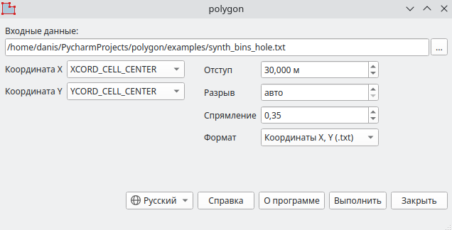
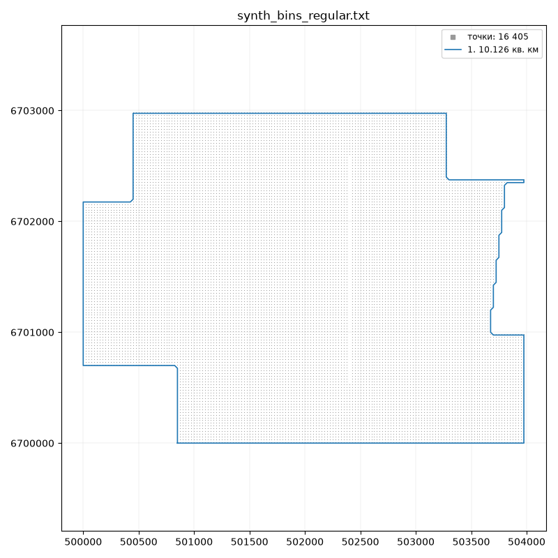
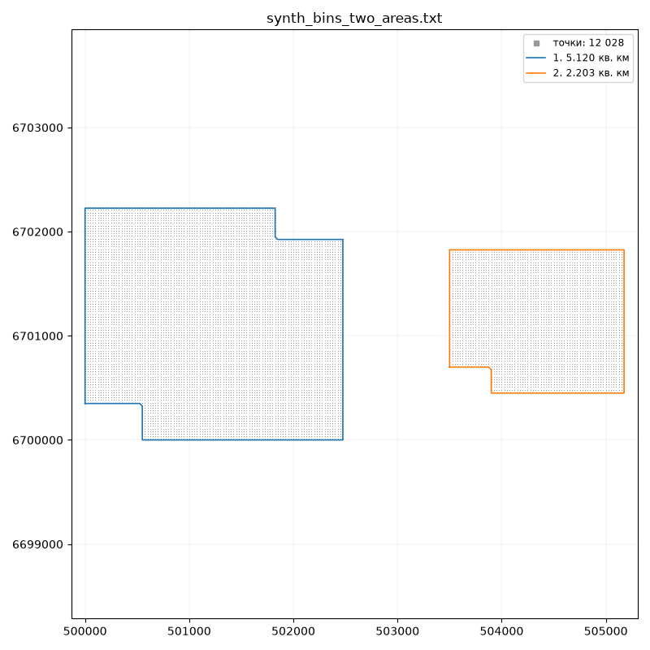
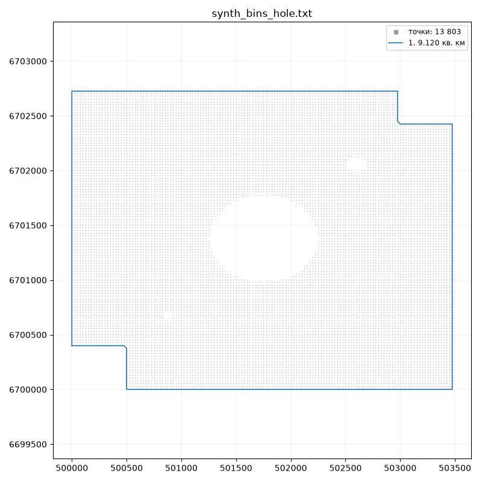

# polygon

Survey boundary polygon from a bin export or from any points, SPS for example:
closed polygons - one per area - from the chosen X and Y columns, usually in
meters. Without a margin it is an outline through the outermost points, with a
margin - a buffer around the area. The polygon then goes to processing as the
survey boundary.

## Download

[:material-microsoft-windows: Windows](https://github.com/daniscoder/daniscoder.github.io/releases/download/polygon/polygon.exe){ .md-button .md-button--primary }
[:material-linux: Linux](https://github.com/daniscoder/daniscoder.github.io/releases/download/polygon/polygon){ .md-button }
[:material-linux: Linux (older systems)](https://github.com/daniscoder/daniscoder.github.io/releases/download/polygon/polygon-legacy){ .md-button }

The Linux version is for systems with glibc 2.38 or newer: Ubuntu 24.04+, Debian
13, Fedora 39+, RHEL, Rocky and Alma 10. For older ones - CentOS 7, RHEL, Rocky and
Alma 8 and 9, Ubuntu 22.04, Debian 12, Astra Linux - use the "Linux (older
systems)" build: it is built with Qt5 and runs on any system with glibc 2.17 or
newer ([details](index.md#run)).

Version 2.5.0. Sample data - synthetic bin exports, the pictures below are made
from them:

- [synth_bins_regular.txt](examples/synth_bins_regular.txt) - an area with a
  ragged edge and a missing bin line;
- [synth_bins_hole.txt](examples/synth_bins_hole.txt) - a large hole in the
  middle and two small ones;
- [synth_bins_two_areas.txt](examples/synth_bins_two_areas.txt) - two areas a
  kilometer apart.

## Input data

A text bin export (CMP_info) or points (SPS, for example): a header line and data
lines in columns separated by spaces. There may be any number of columns - the
program reads only the two chosen ones. By default it takes XCORD_CELL_CENTER and
YCORD_CELL_CENTER, and if there are none - x and y.

## How the outline is built

**Bins on a regular grid.** The program finds the grid from the points
themselves, so it needs neither line numbers nor the survey azimuth. The edge of
the area is traced bin by bin, and the file gets the coordinates of the outermost
bins themselves; a ragged edge is traced as it is.

**Points not on a grid** - SPS, 2D lines, surveys with different spacing. The
points are joined into triangles, and triangles with a side longer than the
**gap** are dropped; the rest is the area. The gap is found from the data ("auto")
or set by hand: a smaller one keeps the outline closer to the points, a larger
one cuts protruding corners and merges nearby areas. Concave corners that the
triangulation cuts diagonally are squared - how boldly is set by the Squaring
field («Спрямление»).

## Margin

Zero - an outline through the outermost points. Greater than zero - a buffer: the
area grows outwards by the margin, all points end up fully inside, and the buffer
corners are square. Buffers of areas closer than two margins merge.

The pictures on this page are made with a 30 m margin.

## Result

Each area gets its own polygon, from the largest to the smallest. For X, Y
coordinates a `<name>_polygon.txt` appears next to the input file, and with
several areas - a file per polygon: `<name>_polygon_1.txt`, `_2.txt` and so on.
For Surfer - a single `<name>_polygon.bln` with all polygons.

When done, the program reports the area of every polygon and shows them in a
picture together with the points. Holes inside areas do not go into the polygons -
their number is reported too.

## Version history

| Version | What's new |
|---|---|
| 2.5.0 | Outline from points not on a grid (SPS), a polygon per area, a picture of the result, squaring of concave corners; later - a Qt5 build for CentOS 7 and other old Linux systems |
| 2.4.0 | Output for Surfer (.bln), help in the window |
