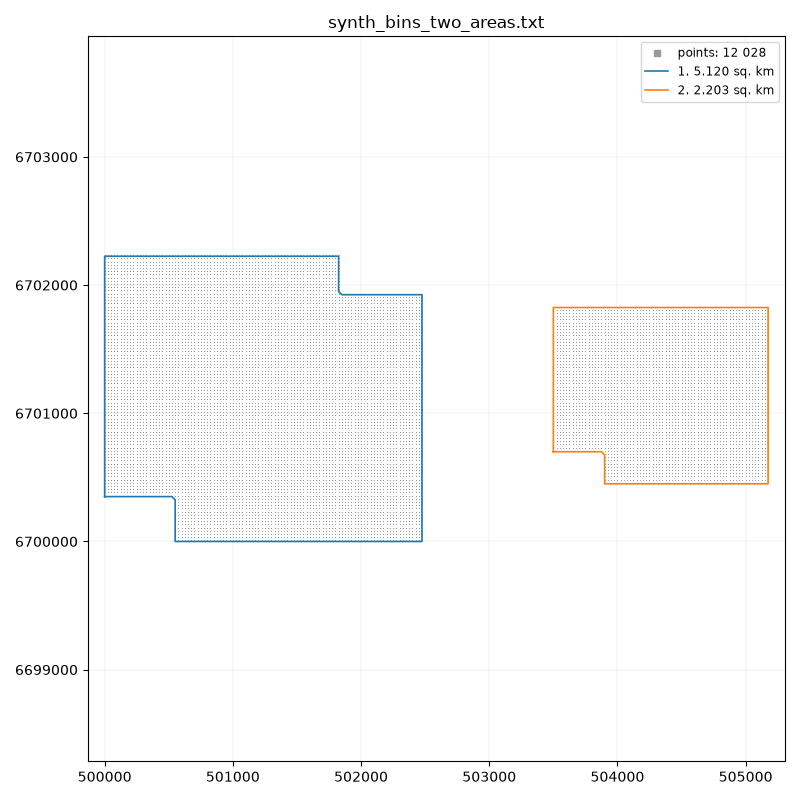
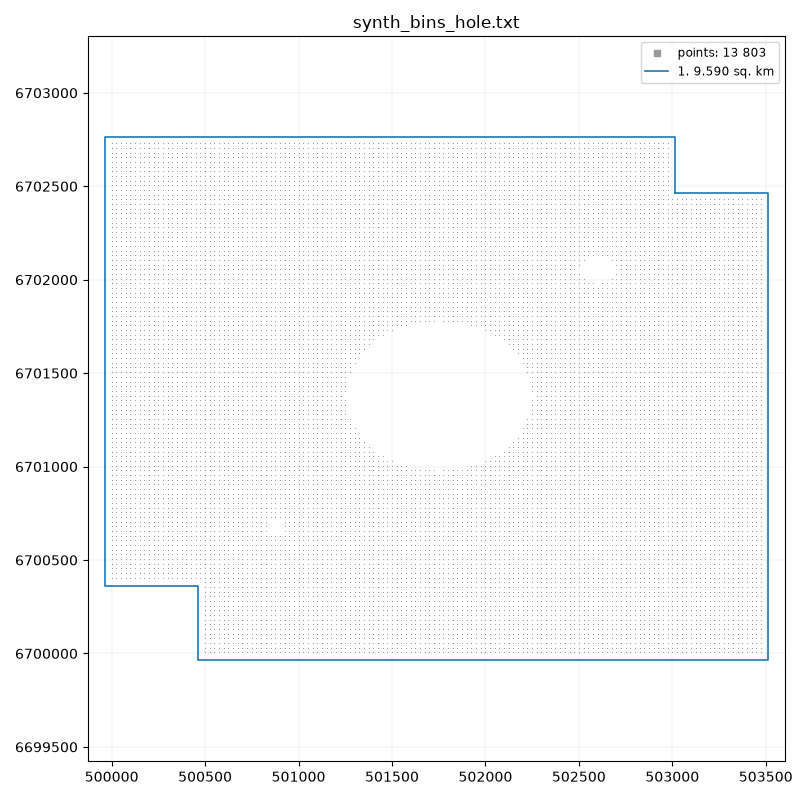

# polygon

**Building the survey boundary polygon**

The utility builds the boundary of the survey area from a bin export or from an
arbitrary set of points, SPS data for example. A closed polygon is built from the
chosen X and Y columns (usually in meters).

There are two modes:

- without a margin - an outline through the outermost survey points;
- with a margin - an outline with a buffer zone offset outward from the area.

If the survey consists of several separate areas, for example two blocks a
kilometer apart, the program finds them by itself and builds a polygon for each.
Every polygon is written to its own file, and for Surfer all of them are collected
in one BLN file. When building with a margin, areas closer to each other than two
margins merge into one.

The resulting polygon is used in further processing as the survey boundary.

## Download

[:material-microsoft-windows: Windows](https://github.com/daniscoder/daniscoder.github.io/releases/download/polygon/polygon.exe){ .md-button .md-button--primary }
[:material-linux: Linux](https://github.com/daniscoder/daniscoder.github.io/releases/download/polygon/polygon){ .md-button }
[:material-linux: Linux (older systems)](https://github.com/daniscoder/daniscoder.github.io/releases/download/polygon/polygon-legacy){ .md-button }

The Linux version is for systems with glibc 2.38 or newer: Ubuntu 24.04 and
newer, Debian 13, Fedora 39 and newer, RHEL, Rocky and Alma 10. For older systems -
CentOS 7, RHEL, Rocky and Alma 8 and 9, Ubuntu 22.04, Debian 12, Astra Linux -
there is the "Linux (older systems)" build: it is built with Qt5 and runs on any
system with glibc 2.17 or newer ([details](index.md#run)).

The current version is 2.7.0. To try the program, you can download synthetic bin
exports; the illustrations below are made from them:

- [synth_bins_regular.txt](examples/synth_bins_regular.txt) - an area with a
  ragged edge and a missing line of bins;
- [synth_bins_hole.txt](examples/synth_bins_hole.txt) - an area with a large hole
  in the middle and two small ones;
- [synth_bins_two_areas.txt](examples/synth_bins_two_areas.txt) - two areas a
  kilometer apart.

## Input data

The input is a text export of bins (CMP_info) or of points, SPS for example: a
header line and data lines, columns separated by spaces. There may be any number
of columns - the program reads only the two chosen ones. By default these are
XCORD_CELL_CENTER and YCORD_CELL_CENTER, and if there are none - x and y.

## How the outline is built

**Bins on a regular grid.** The program finds the grid from the points
themselves, so it needs neither the grid origin nor the survey rotation angle.
The edge of the area is traced bin by bin, and the file gets the coordinates of
the outermost bins themselves. A ragged edge is traced as it is, without
smoothing.

**Points not on a grid** - SPS, 2D lines, surveys with different spacing. The
points are joined into triangles, and triangles with a side longer than the
**gap** are dropped; the remaining ones make up the area. The gap is chosen from
the data ("auto") or set by hand: a smaller value keeps the outline closer to the
points, a larger one cuts protruding corners and merges nearby areas. Concave
corners that the triangulation cuts diagonally are squared; how strongly is set
by the "Squaring" field.

## Margin

With a zero margin the outline goes through the outermost points. If the margin
is greater than zero, a buffer is built: the area is expanded outward by the
margin, all points end up fully inside, and the corners of the buffer stay
square. Buffers of areas closer to each other than two margins merge.

The illustrations on this page are made with a 30 m margin.

## Output

A separate polygon is built for each area, numbered from the largest area to the
smallest. For X, Y coordinates a file `<name>_polygon.txt` appears next to the
input file, and if there are several areas - a file per polygon:
`<name>_polygon_1.txt`, `_2.txt` and so on. For Surfer one file
`<name>_polygon.bln` with all polygons is written.

When it finishes, the program reports the area of each polygon and shows them in a
picture together with the points. Holes inside the areas are not included in the
polygons; their number is also given in the summary.

## Version history

| Version | What's new |
|---|---|
| 2.7.0 | Chinese interface (Simplified): the language follows the system and can be switched in the window |
| 2.6.0 | English interface: the language follows the system and can be switched in the window |
| 2.5.0 | Outline from points not on a grid (SPS), a polygon per area, a picture of the result, squaring of concave corners; later - a Qt5 build for CentOS 7 and other old Linux systems |
| 2.4.0 | Output for Surfer (.bln), help in the window |
