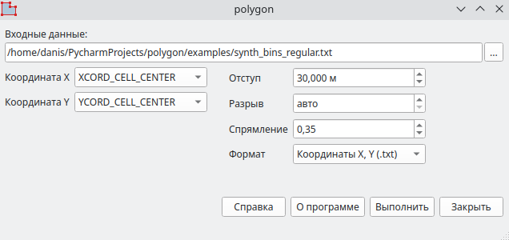
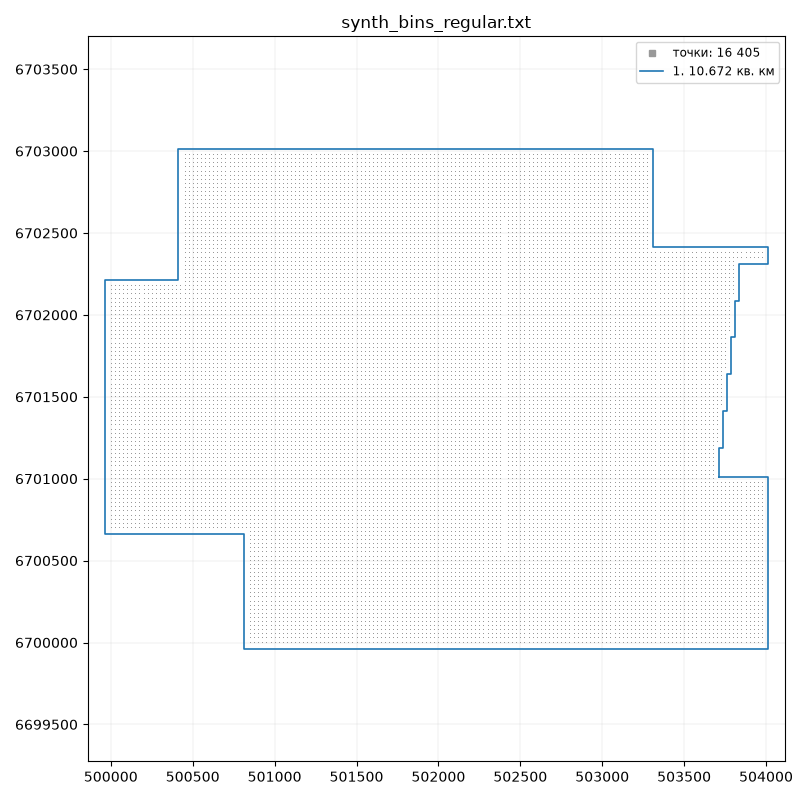
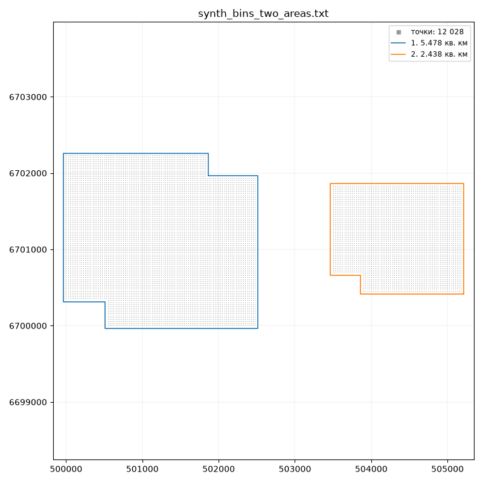
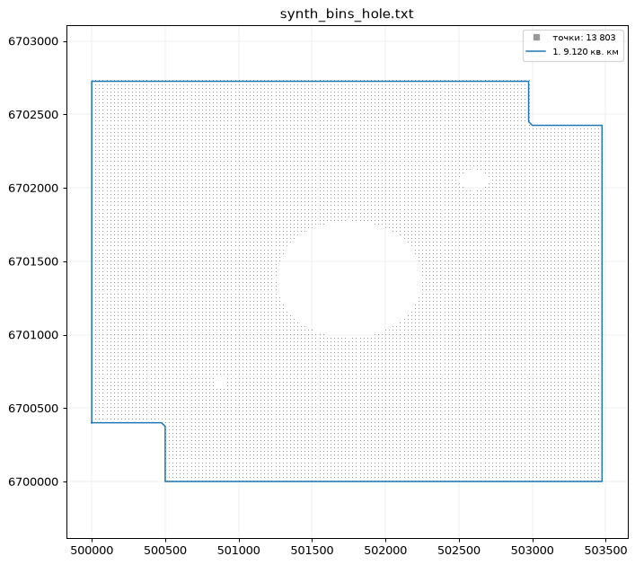

# polygon

Полигон границы съемки по выгрузке бинов или по любым точкам, например SPS:
замкнутые полигоны - по одному на площадь - из выбранных колонок X и Y, обычно в
метрах. Без отступа это контур по крайним точкам, с отступом - буфер снаружи
площади. Дальше полигон идет в обработку как граница съемки.

## Скачать

[:material-microsoft-windows: Windows](https://github.com/daniscoder/daniscoder.github.io/releases/download/polygon/polygon.exe){ .md-button .md-button--primary }
[:material-linux: Linux](https://github.com/daniscoder/daniscoder.github.io/releases/download/polygon/polygon){ .md-button }
[:material-linux: Linux (старые системы)](https://github.com/daniscoder/daniscoder.github.io/releases/download/polygon/polygon-legacy){ .md-button }

Linux-версия - для систем с glibc 2.38 и новее: Ubuntu 24.04+, Debian 13,
Fedora 39+. Для более старых - CentOS 7, RHEL, Rocky и Alma 8 и 9, Ubuntu 22.04,
Debian 12, Astra Linux - сборка «Linux (старые системы)»: она на Qt5 и запускается на
любой системе с glibc 2.17 и новее ([подробнее](index.md#run)).

Версия 2.5.0. Примеры для пробы - синтетические выгрузки бинов, на них сняты
картинки ниже:

- [synth_bins_regular.txt](examples/synth_bins_regular.txt) - площадь с рваным
  краем и пропущенной линией бинов;
- [synth_bins_hole.txt](examples/synth_bins_hole.txt) - большая дыра посередине
  и две мелкие;
- [synth_bins_two_areas.txt](examples/synth_bins_two_areas.txt) - две площади в
  километре друг от друга.

## Входные данные

Текстовая выгрузка бинов (CMP_info) или точек (например, SPS): строка заголовка и
строки данных в колонках, разделитель - пробелы. Колонок может быть сколько
угодно - программа разбирает только две выбранные. По умолчанию берутся
XCORD_CELL_CENTER и YCORD_CELL_CENTER, а если их нет - x и y.

## Как строится контур

**Бины на регулярной сетке.** Сетку программа находит по самим точкам, поэтому
ни ординаты, ни поворот съемки ей не нужны. Кромка площади обходится бин за
бином, и в файл идут координаты самих крайних бинов; изрезанный край обходится
как есть.

**Точки не на сетке** - SPS, профили, съемки с разным шагом. Точки соединяются в
треугольники, и треугольники со стороной длиннее **разрыва** выбрасываются;
остальные и есть площадь. Разрыв подбирается по данным («авто») или задается
руками: меньший ведет контур ближе к точкам, больший срезает выступающие углы и
сливает близкие площади. Вогнутые углы, которые триангуляция срезает наискось,
спрямляются - насколько смело, задает поле «Спрямление».

## Отступ

Ноль - контур по крайним точкам. Больше нуля - буфер: площадь расширяется наружу
на отступ, и все точки оказываются внутри целиком, углы буфера прямые. Буферы
площадей, между которыми меньше двух отступов, сливаются.

Картинки на этой странице сняты с отступом 30 м.

## Результат

На каждую площадь - свой полигон, от большой к малой. Для координат X, Y рядом с
входным файлом появляется `<имя>_polygon.txt`, а при нескольких площадях - файл на
полигон: `<имя>_polygon_1.txt`, `_2.txt` и далее. Для Surfer - один
`<имя>_polygon.bln` на все полигоны.

По окончании программа называет площадь каждого полигона и показывает их на
картинке вместе с точками. Дырки внутри площадей в полигоны не идут - их число
тоже названо в итоге.

## История версий

| Версия | Что нового |
|---|---|
| 2.5.0 | Контур и по точкам не на сетке (SPS), полигон на каждую площадь, картинка с результатом, спрямление вогнутых углов; позже - сборка на Qt5 для CentOS 7 и других старых Linux |
| 2.4.0 | Вывод для Surfer (.bln), справка в окне |
