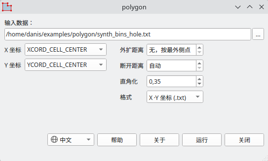
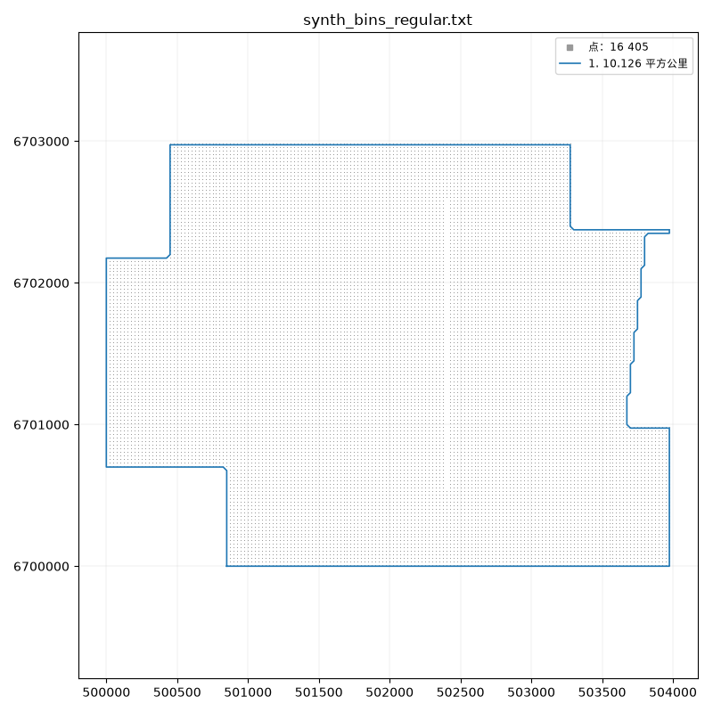
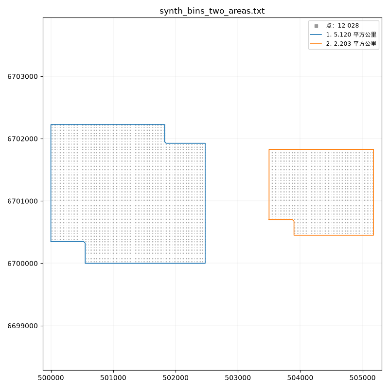
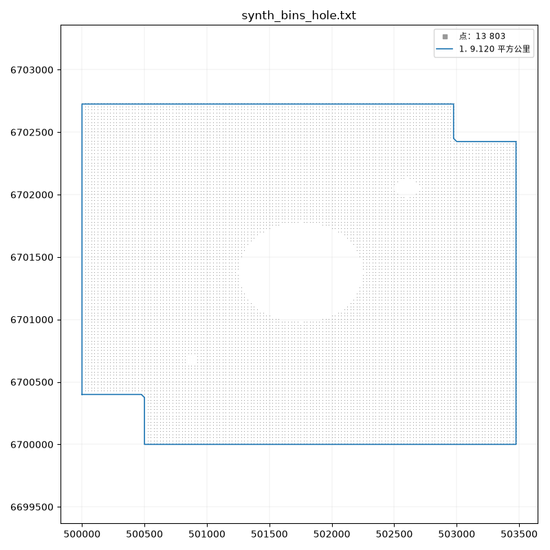

# polygon

**构建工区边界多边形**

这个工具根据面元导出或任意点集（例如 SPS 数据）构建工区边界。由所选的 X 和 Y 列（通常以米为单位）构建闭合多边形。

有两种模式：

- 不设外扩距离 - 经过工区最外侧点的轮廓；
- 设置外扩距离 - 向区域外偏移的带缓冲区的轮廓。

如果工区由几个彼此分离的区域组成，例如相距一公里的两个区块，程序会自动识别并为每个区域分别构建多边形。
每个多边形写入单独的文件，用于 Surfer 时所有多边形汇总在一个 BLN 文件中。设置外扩距离时，相距小于两倍外扩距离的区域会合并为一个。

得到的多边形在后续处理中用作工区边界。

## 下载

[:material-microsoft-windows: Windows](https://github.com/daniscoder/daniscoder.github.io/releases/download/polygon/polygon.exe){ .md-button .md-button--primary }
[:material-linux: Linux](https://github.com/daniscoder/daniscoder.github.io/releases/download/polygon/polygon){ .md-button }
[:material-linux: Linux（旧系统）](https://github.com/daniscoder/daniscoder.github.io/releases/download/polygon/polygon-legacy){ .md-button }

Linux 版适用于 glibc 2.38 或更新版本的系统：Ubuntu 24.04 及更新版本、Debian 13、Fedora 39 及更新版本、
RHEL、Rocky 和 Alma 10。对于更旧的系统 - CentOS 7、RHEL、Rocky 和 Alma 8 与 9、Ubuntu 22.04、Debian 12、
Astra Linux - 有“Linux（旧系统）”版本：它用 Qt5 构建，可以在任何 glibc 2.17 或更新版本的系统上运行
（[详情](index.md#run)）。

当前版本为 2.7.0。要试用程序，可以下载合成的面元导出文件；下面的插图就是用它们制作的：

- [synth_bins_regular.txt](examples/synth_bins_regular.txt) - 边缘参差不齐、缺一行面元的区域；
- [synth_bins_hole.txt](examples/synth_bins_hole.txt) - 中间有一个大空洞和两个小空洞的区域；
- [synth_bins_two_areas.txt](examples/synth_bins_two_areas.txt) - 相距一公里的两个区域。

## 输入数据

输入是面元（CMP_info）或点（例如 SPS）的文本导出：一行表头和若干数据行，各列以空格分隔。列数不限 -
程序只读取所选的两列。默认是 XCORD_CELL_CENTER 和 YCORD_CELL_CENTER，如果没有，则取 x 和 y。

## 轮廓的构建方法

**规则网格上的面元。**程序根据点本身确定网格，因此不需要网格原点，也不需要工区旋转角。区域边缘逐个面元绕行，
写入文件的是最外侧面元本身的坐标。参差不齐的边缘按原样绕行，不做平滑。

**不在网格上的点** - SPS、测线、不同步长的工区。点被连接成三角形，边长超过**断开距离**的三角形被舍弃；
其余的三角形就构成区域。断开距离可以根据数据确定（“自动”），也可以手动设置：数值越小，轮廓越贴近点；
数值越大，越会切掉突出的角并合并相邻的区域。三角剖分斜着切过的凹角会被改为直角；力度由“直角化”字段设置。

## 外扩距离

外扩距离为零时，轮廓经过最外侧的点。如果外扩距离大于零，则构建缓冲区：区域向外扩展该距离，所有点都完整地位于其内，
缓冲区的角保持直角。相距小于两倍外扩距离的区域，其缓冲区会合并。

本页的插图都是以 30 米外扩距离制作的。

## 结果

每个区域分别构建一个多边形，按面积从大到小编号。X、Y 坐标格式时，输入文件旁会生成 `<name>_polygon.txt` 文件；
有多个区域时，每个多边形一个文件：`<name>_polygon_1.txt`、`_2.txt` 等。Surfer 格式时写出一个包含所有多边形的
`<name>_polygon.bln` 文件。

计算结束后，程序给出每个多边形的面积，并将多边形与点一起显示在图上。区域内的空洞不计入多边形；其数量也在结果中给出。

## 版本历史

| 版本 | 新内容 |
|---|---|
| 2.7.0 | 中文界面（简体）：语言跟随系统，也可以在窗口中切换 |
| 2.6.0 | 英文界面：语言跟随系统，也可以在窗口中切换 |
| 2.5.0 | 根据不在网格上的点（SPS）构建轮廓，每个区域一个多边形，结果图，凹角直角化；后来增加了用于 CentOS 7 及其他旧 Linux 的 Qt5 版本 |
| 2.4.0 | Surfer 格式输出（.bln），窗口内帮助 |
